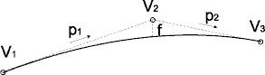

# Calcular alzado nuevo

[Ficha de herramientas Alzado](../../../fichas-de-herramientas/untitled-244.md)

Para calcular un alzado nuevo se puede seleccionar la herramienta Nuevo de la [Ficha de herramientas Alzado](../../../fichas-de-herramientas/untitled-244.md). El programa pedirá al usuario que designe en pantalla los vértices que componen el estado de alineaciones del alzado. Estos puntos pueden ser designados con el botón izquierdo del ratón, finalizando con el botón derecho.

Una vez que se haya finalizado la introducción de los vértices el programa mostrará el siguiente cuadro de diálogo donde se podrá modificar la configuración del alzado, pudiendo introducir acuerdos parabólicos.

Este cuadro de diálogo también es mostrado si se pide información acerca de un alzado existente con la herramienta Info de la barra de herramientas.

En este cuadro de diálogo se muestran los siguientes campos:

* **Información del alzado**: Muestra información general del alzado como el trazado al que pertenece, el nombre y el tipo de alzado, pudiendo ser este último Rasante o Terreno, en función de si se ha obtenido a partir del MDT o dibujado por el propio usuario.
* **Punto 1**: Punto kilométrico y cota del punto 1 del segmento seleccionado. La pendiente corresponde con la pendiente del segmento anterior.
* **Punto 2**: Punto kilométrico y cota del punto 2 del segmento seleccionado. La pendiente corresponde con la pendiente del segmento anterior, es decir, el que le une con el punto 1.
* **Punto 3**: Punto kilométrico y cota del punto 3 del segmento seleccionado. La pendiente corresponde con la pendiente del segmento anterior, es decir, el que le une con el punto2.
* **Características del elemento**: Se muestran los diferentes parámetros para definir un acuerdo o, si se ha seleccionado un elemento existente, los parámetros que lo definen. Se podrá definir un alzado modificando los tres primeros parámetros que a continuación se muestran. Mientras se modifican dichos parámetros, se van actualizando el resto de parámetros y sólo permitirá proceder si los puntos kilométricos se sitúan entre los puntos 1 y 3.
  * Parámetro Kv: Constante de la parábola.
  * Flecha: Diferencia de cota entre el vértice 2 y el mismo punto kilométrico en el acuerdo.
  * Longitud: Longitud del acuerdo en metros.
  * PK TE: Punto kilométrico donde el alzado es tangente al estado de alineaciones en su comienzo.
  * PK TS: Punto kilométrico donde el alzado es tangente al estado de alineaciones en su final.
  * Dif. pend.: Diferencia de pendientes en tanto por ciento.

* **Listado con los vértices del alzado**: Se mostrará el listado con los vértices que componen el alzado, mostrando el punto kilométrico, cota y parámetro Kv si contiene un acuerdo parabólico. Asociados a este listado se muestran tres botones:
  * Añadir: Añade un vértice nuevo al alzado al final de éste.
  * Editar: Edita el punto actualmente seleccionado. Si se procede a editar un punto se activan todos los campos de los vértices que forman el alzado y aparecen los botones Modificar y Cancelar para aceptar o rechazar los cambios realizados en el acuerdo.
  * Borrar: Borrar el punto actualmente seleccionado.

Además se muestran tres botones con los que hacer diversas operaciones:

* [Insertar vértice interior ](../untitled-143.md): Permite insertar un vértice en el interior del alzado, indicando el punto kilométrico.
* [Buscar intersecciones](../untitled-35.md): Permite buscar intersecciones planimétricas del trazado con otros trazados y calcular la diferencia de cota entre los alzados y actuar en consecuencia.
* [Ajustar a límites del trazado ](untitled-16.md): Permite ajustar los puntos kilométricos inicial y final del alzado a los que tiene el trazado.

