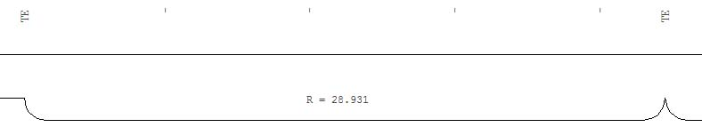
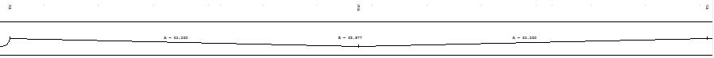

# Guitarra de viales

[Módulo Viales](../)

Desde este cuadro de diálogo se puede configurar el aspecto de la caja que contiene el perfil longitudinal, así como la información adicional que en él aparecerá.

En la parte superior del cuadro de diálogo se deberán seleccionar los elementos que va a incluir la parte inferior de la caja o guitarra. Estos campos serán rellenados automáticamente por el programa a partir de los perfiles calculados. Dichos campos son:

* **Cota roja desmonte/terraplén**: Diferencia entre la cota rasante y la cota terreno. Si la Cota rasante es menor que la Cota terreno, el valor de la cota roja será en desmonte y si no, en terraplén.
* **Cota rasante/terreno**: Valor de la cota sobre la rasante o sobre el modelo digital, es decir, el terreno.
* **Distancias parcial y al origen**: Distancia en metros al origen del perfil o al último punto que se ha referenciado en la guitarra.
* **Puntos**: Se mostrará un texto con el tipo de punto, si éste es un punto importante del trazado. Los textos posibles son TE \(tangente de entrada de elemento curvo\), TS \(tangente de salida de elemento curvo\), TEC \(tangente de entrada de elemento circular entre clotoides\), TSC \(tangente de salida de elemento circular entre clotoides\), Inicio \(comienzo del trazado\) y Final \(final del trazado\).
* **Alineaciones**: Activando esta opción se mostrará un gráfico con las diferentes alineaciones del trazado. Así se mostrarán las rectas, curvas circulares y clotoides con diferentes gráficos acompañados por textos con los valores más significativos de estas alineaciones.

   Por ejemplo, para un elemento circular se mostrará el siguiente gráfico:

 Para un elemento con clotoide, se mostrará el siguiente gráfico:

 Estos gráficos mostrarán el sentido de la curva, en función de la posición en la que se dibuje \(arriba o abajo\).

* **Peraltes**: Activando esta opción se mostrará un gráfico con los diferentes peraltes del trazado. Este gráfico será representado por dos líneas que representan el peralte en el lado izquierdo y el derecho del vial. La posición de estas líneas dependerá del signo del peralte.

A continuación se debe configurar la posición del plano de comparación de la caja y si se desea una escala vertical, por medio de los siguientes campos:

* **Plano de comparación**: En este campo se elegirá la forma en la que el programa va a calcular la altitud del plano de comparación de los perfiles. Si se elige la opción Absoluta, el programa colocará el plano a la cota indicada en el campo Valor de la altitud . Si se elige la opción Relativo a cada perfil , el programa calculará la altitud del plano restando a la cota más baja de cada perfil la cantidad expresada en el campo Valor de la altitud. Si se elige la opción Relativo a todos los perfiles, el programa calculará la altitud del plano restando a la cota más baja de todos los perfiles la cantidad expresada en el campo Valor de la altitud. Si se elige la opción Absoluta, podría ocurrir que se calcule algún perfil cuya cota mínima está por debajo del valor indicado. En este caso, el programa muestra un [cuadro de diálogo ](../../herramientas-mdt/untitled-172/untitled-84.md)donde se podrá se podrá solucionar este conflicto.
* **Valor de la altura**: Indicará el valor en metros de la altitud absoluta o relativa del plano de comparación.
* **Incluir escala vertical**: Se activará esta casilla si se desean trazar líneas horizontales paralelas al plano de comparación que ayudarán en la lectura del perfil, ya que indicarán diferentes valores de altitud. La distancia entre estas líneas se indicarán en el campo situado debajo de esta casilla.

Posteriormente, se deberá indicar el código en el que se registrarán las entidades que conforman la propia caja de la guitarra por medio de los campos Código Guitarra y Código Líneas Internas.

Por último, se tendrá que seleccionar de la lista qué textos van a aparecer en la caja y alrededor de ella. Si se desea que aparezca un determinado texto, se deberá activar la casilla Incluir que aparece debajo de dicha lista. Al activarse se mostrarán los parámetros para el texto, que son:

* **Posición**: Se indicará la posición de texto respecto de la caja de perfil, pudiendo ser colocado alrededor de ella. Esta opción no se mostrará para los textos de Información y Acuerdos
* **Código de texto**: Se indicará el código en el que se registrará en el texto.
* **Altura de texto**: Se indicará el valor de la altura del texto en metros.

Los textos que se puede incluir son los siguientes:

* **Nombre**: Indica el nombre del perfil.
* **Escalas**: Indica el valor de la escala horizontal y vertical del perfil, señalados en el [Cuadro de diálogo Información del documento viales ](../general/untitled-137.md).
* **Superficies**: Si se dispone de rasante, se podrá calcular y mostrar el valor de las superficies de desmonte y terraplén.
* **Información**: Estos textos son los generados para los campos seleccionados en la parte superior del cuadro de diálogo y que se muestran a modo de guitarra en el parte inferior de la caja. La configuración de estos textos es diferente al resto y contiene los siguientes campos:
* **Distancia al origen**: Distancia en metros al origen del primer punto del perfil longitudinal.
* **Distancia al último punto**:
* **Información**: Se podrá indicar si se desea información en todas las inflexiones de los perfiles \(siempre y cuando no se solapen\) o cada una cierta distancia.
* **Acuerdos**: Activando este elemento, el programa mostrará una caja encima de cada acuerdo parabólico con las características de éste. Estas características son el punto kilométrico, la cota, el parámetro Kv , la longitud y la flecha.

