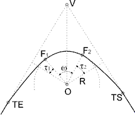

# Insertar elemento curvo

[Ficha de herramientas Trazado](../../fichas-de-herramientas/untitled-255.md)

Una vez se haya registrado el estado de alineaciones de un nuevo trazado, es posible insertar elementos curvos tangentes a los segmentos que componen dicho estado de alineaciones.

Para ello se debe seleccionar la opción Insertar curva de la [Ficha de herramientas Trazado](../../fichas-de-herramientas/untitled-255.md). El programa pedirá que se seleccione el lugar donde se desea insertar el elemento curvo, para lo cual, el usuario deberá dar con el botón izquierdo del ratón un punto del estado de alineaciones cercano al vértice que soportará el nuevo elemento curvo.

Una vez aceptado el lugar para encajar el elemento curvo, el programa muestra un cuadro de diálogo donde se muestran las coordenadas del vértice, del punto anterior y del punto posterior. Asimismo, muestra los acimuts y longitudes de las tangentes, representadas por los segmentos que unen los puntos anterior y posterior al vértice.

En la parte inferior del cuadro de diálogo se pueden modificar los parámetros que definirán el elemento curvo. Según se vayan introduciendo el programa, automáticamente, irá calculando los puntos de tangencia, cuyas coordenadas se expresan en la parte derecha, y el resto de parámetros. Para que un elemento curvo sea válido, la distancia entre el vértice y los puntos de tangencia deberán ser inferiores a las longitudes de las tangentes mostradas en la parte superior. Si el elemento no es válido no se mostrarán las coordenadas de los puntos de tangencia y no se activará el botón Aceptar para salir del cuadro de diálogo.

Los parámetros que definen el elemento curvo son los siguientes:

* **Tipo de curva**: Se deberá seleccionar el tipo de curva que se desea introducir entre los siguientes:
  * Círculo: Elemento curvo compuesto únicamente por un círculo. Seleccionando este tipo sólo se visualizarán los parámetros del círculo central.
  * Clotoide-Círculo: Elemento curvo compuesto por una clotoide de entrada seguida por un círculo. Seleccionando este tipo se visualizarán los parámetros de la clotoide de entrada y del círculo central.
  * Círculo-Clotoide: Elemento curvo compuesto por un círculo seguido por una clotoide de salida. Seleccionando este tipo se visualizarán los parámetros del círculo central y de la clotoide de salida.
  * Clotoide-Círculo-Clotoide Asimétrica: Elemento curvo compuesto por una clotoide de entrada, seguida por un círculo y terminando con una clotoide de salida. La clotoide de entrada y de salida no tienen porque coincidir. Seleccionando este tipo se visualizarán los parámetros de la clotoide de entrada, del círculo central y de la clotoide de salida.
  * Clotoide-Círculo-Clotoide Simétrica: Elemento curvo compuesto por una clotoide de entrada, seguida por un círculo y terminando con una clotoide de salida. La clotoide de entrada y de salida son idénticas. Seleccionando este tipo se visualizarán los parámetros de la clotoide de entrada, del círculo central y de la clotoide de salida, pero no se podrán seleccionar los de esta última porque son iguales que la clotoide de entrada.
* **Clotoide de entrada**: La clotoide puede ser definida a partir de cuatro parámetros:
  * Longitud: Longitud de la clotoide desde la tangente de entrada al punto F donde comienza el círculo. Expresado en metros.
  * Ángulo t: Ángulo formado por la perpendicular trazada desde el centro del círculo a la tangente de entrada con el radio al punto F, donde comienza el círculo. Expresado en grados centesimales.
  * Constante A: Constante de definición de esta curva de transición. Unidad adimensional.
  * Distancia TE-V: Distancia entre el vértice y la tangente de entrada. Expresada en metros.
* **Círculo central**: Este elementos puede ser definido por cuatro parámetros:
  * Radio: Distancia medida en metros del centro del círculo a los puntos de tangencia \(en caso de ser un elemento curvo formado sólo por un círculo\) o al punto F de comienzo del círculo después \(o antes\) de una clotoide.
  * Ángulo: Ángulo medido en grados centesimales formado por los radios a los puntos de comienzo y final del elemento circular. Si el elemento curvo está formado por sólo por un círculo no se podrá modificar.
  * Distancia TE-V: Distancia ente el vértice y la tangente de entrada expresada en metros. Sólo aparecerá cuando el elemento curvo está formado sólo por un círculo.
  * Distancia V-TS: Distancia ente el vértice y la tangente de salida expresada en metros. Sólo aparecerá cuando el elemento curvo está formado sólo por un círculo.
* **Clotoide de salida**: La definición de la clotoide de salida se realiza con los mismos parámetros explicados en el caso de la clotoide de entrada.

Además de las múltiples formas de definición de un elemento curvo, se han añadido dos botones o para acceder a la [calculadora de elementos curvos](../general/untitled-52.md), que mostrará más parámetros y ayudará al usuario en dicha definición.

Una vez aceptados los datos, el trazado será modificado y aparecerán los puntos de tangencia nuevos calculados. Tanto estos puntos como el radio del elemento curvo pueden ser modificados gráficamente con la opción Editar de la [Ficha de herramientas Trazado](../../fichas-de-herramientas/untitled-255.md). Si con esta herramienta se mueven los puntos de tangencia, se modificará el valor del radio. Si se mueve la posición del vértice, se variará la posición de los puntos de tangencia.

 También es posible editar numéricamente un elemento curvado seleccionando el comando Editar curva de la [Ficha de herramientas Trazado](../../fichas-de-herramientas/untitled-255.md), mostrándose este mismo cuadro de diálogo.

