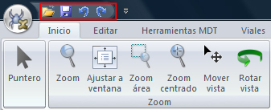

# Barra de herramientas de acceso rápido

[Cinta de herramientas](/mdtopx/cinta-de-herramientas/)

La cinta de herramientas incluye una barra de herramientas configurable donde figuran los comandos más útiles. En esta barra se incluyen los iconos de los comandos en un tamaño pequeño.

La primera vez que se utiliza el programa, se incluyen por defecto los siguientes comandos

* Abrir archivo: Comando alojado en el [botón de MDTopX](../introduccion/boton-de-mdtopx.md).
* Guardar archivo: Comando alojado en el [botón de MDTopX](../introduccion/boton-de-mdtopx.md).
* Deshacer: Deshace la última modificación realizada sobre el documento actual. Esta herramienta puede ser seleccionada pulsando las teclas \[CTRL] + \[Z]. Se puede configurar la cantidad de modificaciones a guardar desde el cuadro de [diálogo de Opciones](../otras-herramientas/opciones.md) , a la que se puede acceder desde el [botón de MDTopX](../introduccion/boton-de-mdtopx.md).
* Rehacer: Rehace la última modificación deshecha anteriormente. Esta herramienta puede ser seleccionada pulsando las teclas \[CTRL] + \[Y]

Operaciones permitidas con la barra de herramientas de acceso rápido:

* [Mover la barra de herramientas de acceso rápido](/mdtopx/cinta-de-herramientas/mover-la-barra-de-herramientas-de-acceso-rapido.md) para colocarla por debajo o por encima de la cinta de herramientas
* [Personalizar la barra de herramientas de acceso rápido](/mdtopx/cinta-de-herramientas/personalizar-la-barra-de-herramientas-de-acceso-rapido.md) para agregar botones que representarán los comandos que utiliza frecuentemente
