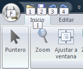

# Utilizar la cinta de herramientas mediante teclado

Si prefiere utilizar el teclado en lugar ratón, MDTopX proporciona accesos directos de teclado para permitirle realizar tareas rápidamente sin utilizar el ratón.

Las claves de acceso proporcionan un medio para utilizar un comando rápidamente presionando unas pocas teclas, sin importar dónde se encuentre en el programa. Todos los comandos de un programa de la cinta de herramientas permiten el acceso mediante una tecla de acceso. Puede llegar a la mayoría de los comandos usando de dos a cuatro pulsaciones.

* Presione y suelte la tecla ALT. Se muestra información sobre teclas para cada función disponible en la vista actual.

* Presione la letra que aparece en la información sobre teclas acerca de la función que desee utilizar.
* En función de la tecla que presione, quizá se muestre información adicional sobre las teclas.
* Siga presionando letras hasta que presione la letra del comando o control específicos que desea utilizar.
* Para cancelar la acción que esté realizando y ocultar la información sobre teclas, presione y suelte la tecla ALT.

Otra forma de utilizar el teclado para trabajar con los programas de la cinta de herramientas es mover el foco entre las fichas y comandos hasta encontrar la función que se desee utilizar. La tabla siguiente muestra algunas formas de desplazar el foco del teclado sin utilizar el ratón.

|  Para:                                                                                                                                                                                                                                            |  Presione                                                                                                |
| ------------------------------------------------------------------------------------------------------------------------------------------------------------------------------------------------------------------------------------------------- | -------------------------------------------------------------------------------------------------------- |
| Seleccionar la ficha activa de la cinta de herramientas y activar las teclas de acceso.                                                                                                                                                           | ALT o F10. Presione cualquiera de estas teclas para volver al documento y cancelar las teclas de acceso. |
| Ir a otra ficha de la cinta de herramientas.                                                                                                                                                                                                      | ALT o F10 para seleccionar la ficha activa y, a continuación, FLECHA IZQUIERDA o FLECHA DERECHA          |
| Minimizar o restaurar la cinta de herramientas.                                                                                                                                                                                                   | CTRL+F1                                                                                                  |
| Mostrar el menú contextual del comando seleccionado.                                                                                                                                                                                              | MAY+F10                                                                                                  |
| 
Mover el foco para seleccionar cada una de las áreas siguientes de la ventana:
<ul><li> Ficha activa de la cinta de herramientas</li><li> Ver la barra de estado situada en la parte inferior de la ventana</li><li> Su documento</li></ul> | F6                                                                                                       |
| Mover el foco a cada comando de la cinta de herramientas, hacia delante o hacia atrás.                                                                                                                                                            | ALT o F10 y, a continuación, TAB o MAY+TAB                                                               |
| Subir, bajar ir a la izquierda o la derecha por los elementos de la cinta de herramientas.                                                                                                                                                        | FLECHA ABAJO, FLECHA ARRIBA, FLECHA IZQUIERDA o FLECHA DERECHA                                           |
| Activar el comando o el control seleccionados en la cinta de herramientas.                                                                                                                                                                        | BARRA ESPACIADORA o ENTRAR                                                                               |
| Abrir el menú o la galería seleccionados en la cinta de herramientas.                                                                                                                                                                             | BARRA ESPACIADORA o ENTRAR                                                                               |
| Activar un comando o un control de la cinta de herramientas para poder modificar un valor.                                                                                                                                                        | ENTRAR                                                                                                   |
| Terminar de modificar un valor de un control de la cinta de herramientas y devolver el foco al documento.                                                                                                                                         | ENTRAR                                                                                                   |
| Obtener ayuda sobre el comando o el control seleccionado en la cinta de herramientas (si no hay ningún tema de la Ayuda asociado con el comando seleccionado, en su lugar se muestra un tema de la Ayuda general acerca del programa).            | F1                                                                                                       |
