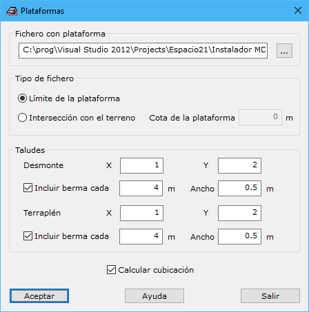
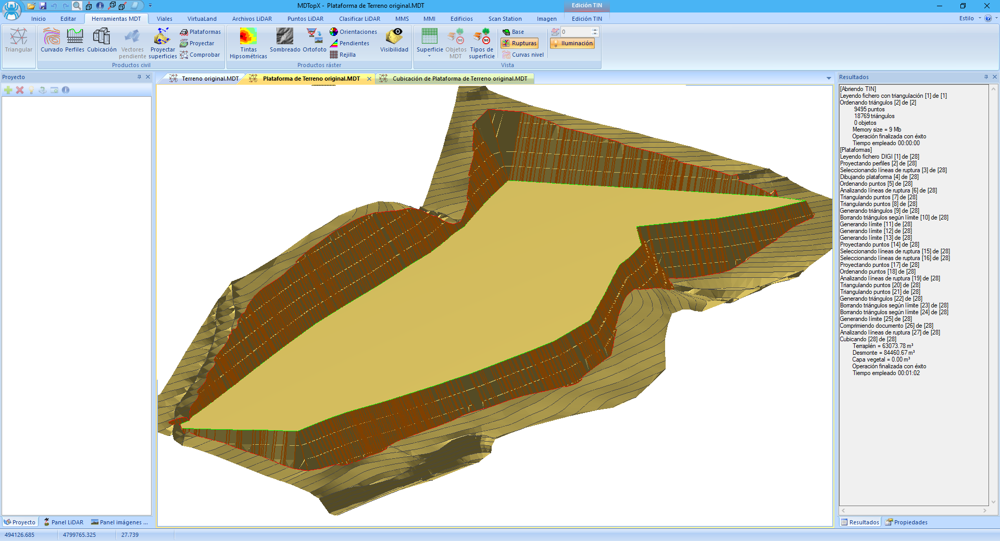
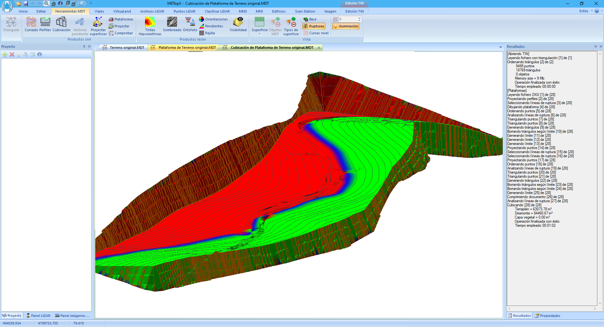

# Ejemplo 6: Cálculo de una plataforma

[Ejemplos](/mdtopx/ejemplos/)

### Objetivo

Obtener el modelo digital de una plataforma proyectada sobre el modelo digital del terreno original.

### Fichero inicial

* Terreno original.mdt: Fichero en formato MDT con el modelo del terreno original.
* limite explanacion.bin: Fichero en formato BIN con el límite de la plataforma.

### Proceso

* Cargar el fichero terreno original.mdt en pantalla. Para ello utilice la orden [Abrir](../operaciones-con-archivos/abrir-archivo.md)del menú del [Botón MDTopX](../introduccion/boton-de-mdtopx.md), seleccionando el tipo de archivos MDT.
* Llamar a la orden [Plataforma](../herramientas-mdt/plataformas.md)de la ficha de herramientas [Herramientas MDT](/mdtopx/herramientas-mdt/). En el cuadro de diálogo introducir como fichero con la plataforma el archivo limite explanacion.bin.
* Indicar que el tipo de fichero es el límite de la plataforma.
*   Indicar un desmonte 1-2 y terraplén 1-2. Incluir en ambos una berma cada 4 metros con

    un ancho de medio metro.
* Activar la opción de cubicación.

### Ficheros resultantes

* Plataforma de Terreno original.mdt: Fichero con formato propio de MDTop con el modelo digital del terreno con la plataforma proyectada. No incluido para ahorrar espacio.

* Cubicacion de Plataforma de Terreno original.mdt: Fichero con formato propio de MDTop con la cubicación resultado de comparar el MDT original y el proyectado. No incluido para ahorrar espacio.

