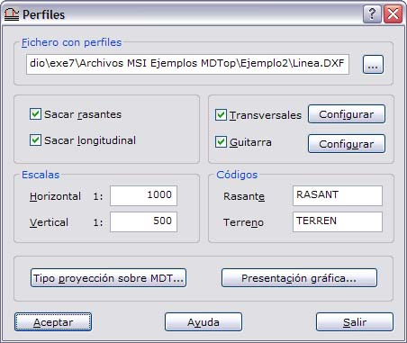
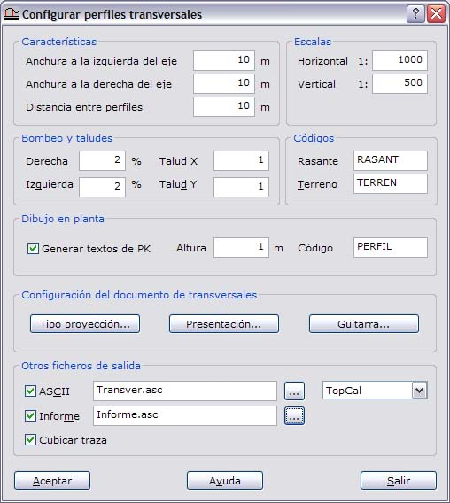
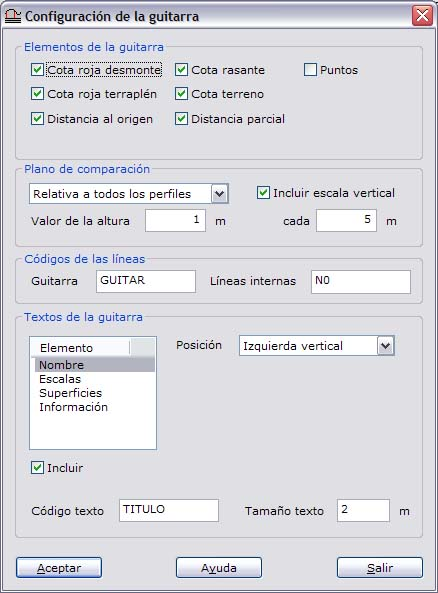
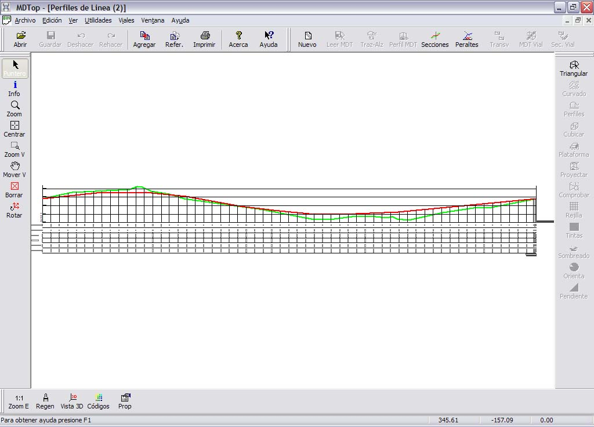
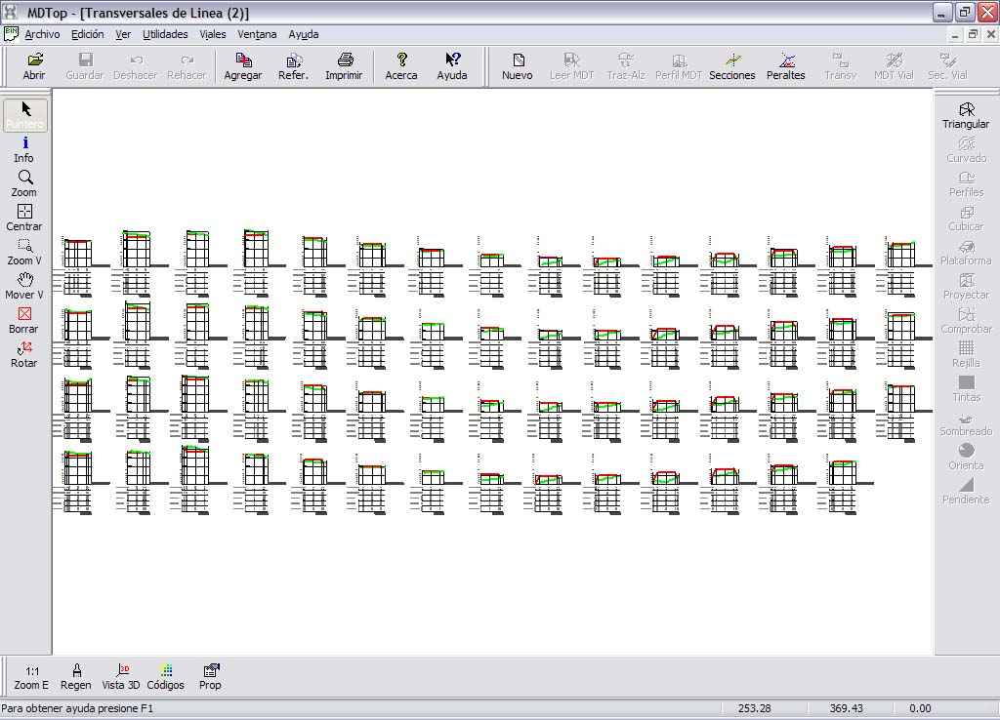
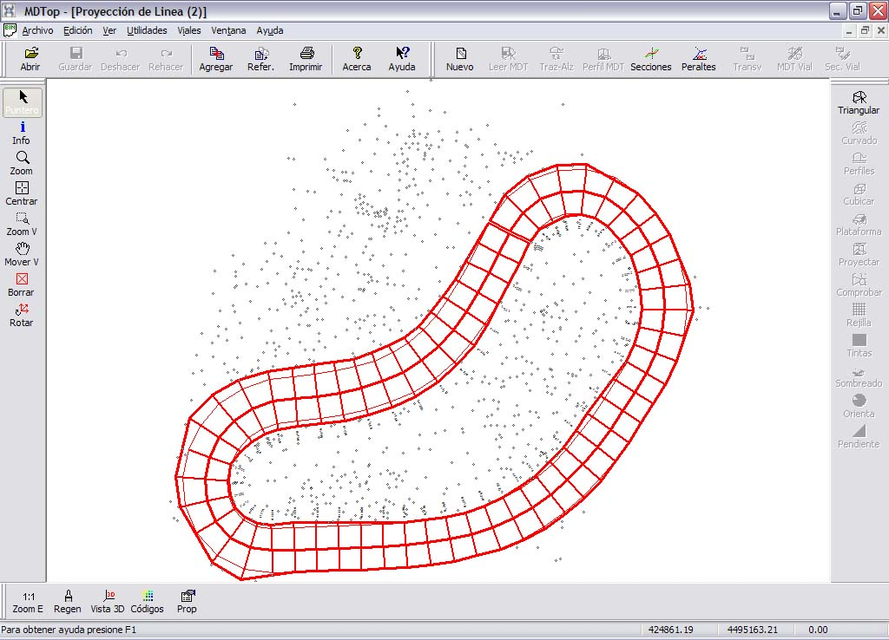
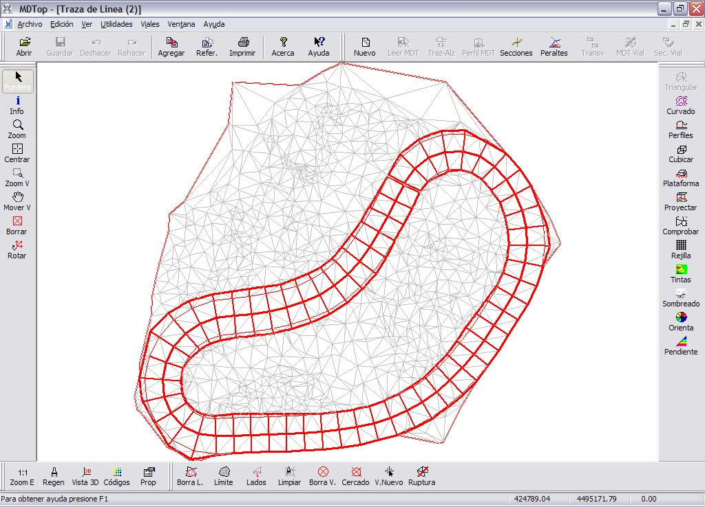
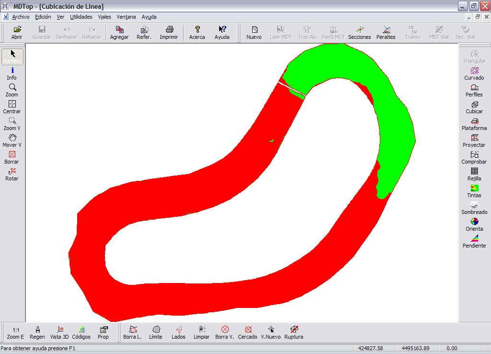

# Ejemplo 2: Obtener los perfiles longitudinales y transversales de una traza

[Ejemplos](/mdtopx/ejemplos/)

### Objetivo

Obtener los perfiles longitudinales y transversales de una traza a partir de un taquimétrico.

### Ficheros iniciales

* RADIA.PTS: Fichero con formato TopCal, y con los puntos tomados en un taquimétrico donde se sitúan los perfiles.
* LINEA.DXF: Fichero con formato DXF de AutoCad, con una línea que representa una traza calculada en gabinete y de la cual se conocen sus coordenadas X,Y,Z de proyecto.

### Proceso

* Cargar el fichero RADIA.PTS en pantalla. Para ello utilice la orden [Abrir](../operaciones-con-archivos/abrir-archivo.md)del menú del [Botón MDTopX](../introduccion/boton-de-mdtopx.md), seleccionando el tipo de archivos TopCal.
* Llamar a la orden [Triangulación](../como/como-triangulacion.md)de la ficha de herramientas [Herramientas MDT](/mdtopx/herramientas-mdt/), que generará un modelo digital del terreno con los datos tomados en el taquimétrico. El fichero sólo está compuesto por puntos, por lo que no tendrá líneas de ruptura. Se genera un modelo digital compuesto por multitud de triángulos visibles en pantalla.
* Con este archivo activo, llamar a la orden [Perfiles](../como/como-perfiles.md)de la ficha de herramientas [Herramientas MDT](/mdtopx/herramientas-mdt/). Aparecerá un cuadro de diálogo que se deberá rellenar con la información de los perfiles, si se desean guitarras, configuración de guitarras, si se desean transversales, si se desea cubicar las trazas, etc.

* Cuando finaliza el cálculo se muestra un cuadro de diálogo con el movimiento de tierras (terraplén y desmonte) y se generan varios archivos en función de las opciones activadas: perfiles longitudinales, transversales, la traza proyectada, el modelo digital con la traza proyectada, la cubicación de la traza... Además se generarán en disco un archivo ASCII con los perfiles transversales en el formato elegido y un fichero ASCII con el informe.

### Ficheros resultantes

* TRIANGULACION DE RADIA: Fichero con el modelo digital del terreno y formato propio de MDTop.
* PERFILES DE LINEA: Fichero con formato dibujo con el perfil longitudinal. Este archivo podrá ser salvado para su edición en formato BIN de DIGI, DXF de AutoCad o DGN de MicroStation.

* TRANSVERSALES DE LINEA: Fichero con formato dibujo con los perfiles transversales. Este archivo podrá ser salvado para su edición en formato BIN de DIGI, DXF de AutoCad o DGN de MicroStation.

* PROYECCION DE LINEA: Fichero con formato dibujo con la planta de la proyección de la línea sobre el terreno. Este archivo podrá ser salvado para su edición en formato BIN de DIGI, DXF de AutoCad o DGN de MicroStation.

* TRAZA DE LINEA: Fichero con formato propio de MDTop con el modelo digital del terreno modificado después de proyectar la traza.

* CUBICACION DE LINEA: Fichero con formato propio de MDTop con la cubicación de la traza.

* INFORME.ASC: Fichero con formato ASCII con la información de los diferentes transversales: PK, superficie de desmonte y superficie de terraplén.

> Transversales de Línea\
> Distancia al Superficies (m²) Volúmenes (m³)\
> Numero origen (m) Desmonte Terraplén Desmonte Terraplén\
> Perfil 1 - 0+000 0.000 2.703 0.559\
> Perfil 1 - 0+010 10.000 14.538 0.000 50.077 2.797\
> Perfil 1 - 0+020 20.000 25.455 0.000 199.967 0.000\
> Perfil 1 - 0+030 30.000 32.134 0.000 287.949 0.000\
> Perfil 1 - 0+040 40.000 29.373 0.000 307.538 0.000

* TRANSVER.ASC: Fichero con formato ASCII con la información de los perfiles transversales en el mismo formato de salida de TopCal: distancia al eje y cota.

> 0,11\
>  \-5.000,927.170\
>  \-4.875,927.170\
>  \-2.916,927.190\
>  0.000,927.250\
>  2.330,927.310\
>  4.222,927.430\
>  5.000,927.460
