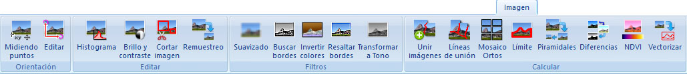

# Ficha de herramientas Imagen

[Cinta de herramientas](/mdtopx/cinta-de-herramientas/)

En esta ficha de herramientas aparecen los comandos relacionados con los documentos ráster de imagen: BMP, TIFF, JPEG o ECW.

Estos comandos aparecen agrupados según los siguientes epígrafes:

* ****[**Orientación**](orientacion.md): Herramientas para cambiar la georreferenciación de la imagen.
* ****[**Editar**](editar-imagen.md): Herramientas para cambiar el contenido de la imagen manualmente.
* ****[**Filtros**](filtros.md): Filtros a aplicar automáticamente al contenido de la imagen.
* ****[**Transformar**](transformar.md):
* ****[**Calcular**](imagen-calcular.md): Diversas herramientas de cálculo de imagen.
