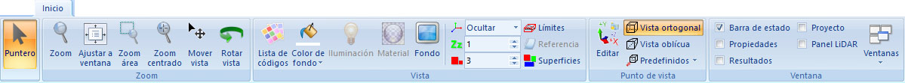

# Ficha de herramientas Inicio

[Cinta de herramientas](/mdtopx/cinta-de-herramientas/)

En esta ficha de herramientas aparecen los comandos generales del programa, así como comandos para modificar la vista actual.

Los comandos aparecen agrupados según los siguientes epígrafes:

* Puntero: Se elegirá esta opción cuando no se desee tener ninguna herramienta activa.
* [Zoom](/mdtopx/fichas-de-herramientas/ficha-de-herramientas-inicio/zoom.md): Comandos relativos al movimiento del zoom sobre la pantalla.
* [Vista](/mdtopx/modulo-laser/vista/): Comandos relativos al aspecto de la vista.
* [Punto de vista](/mdtopx/fichas-de-herramientas/ficha-de-herramientas-inicio/punto-de-vista.md): Comandos relativos al punto de vista.
* [Ventana](/digi3d-net/referencia/ventana-de-dibujo/menus/ventana.md): Comandos relativos a la organización de las ventanas.
