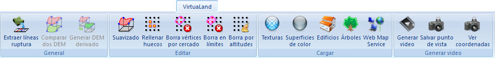

# Ficha de herramientas VirtuaLand

[Cinta de herramientas](/mdtopx/cinta-de-herramientas/)

En esta ficha de herramientas aparecen los comandos relacionados con los documentos de modelos digitales de tipo rejilla del [módulo VirtuaLand](../../modulo-virtualand/).

Estos comandos aparecen agrupados según los siguientes epígrafes:

* ****[**General**](virtualand-general.md)****
* ****[**Editar**](virtualand-editar.md)****
* ****[**Cargar**](virtualand-cargar.md)****
* ****[**Generar Video**](virtualand-generar-video.md)****
