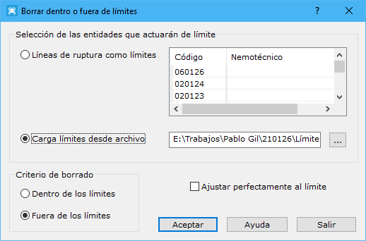

# Borrar fuera o dentro de límites

[Editar Archivo](../fichas-de-herramientas/ficha-de-herramientas-editar/editar-archivo.md)

Esta herramienta permitirá borrar entidades dentro o fuera de límites. Estos límites podrán estar definidos por líneas de ruptura que forman parte del [modelo digital](../como/como-triangulacion.md)o almacenados en líneas cerradas en archivos de dibujo (formato DIGI, AutoCad o MicroStation). Esta utilidad servirá para borrar información donde no se desean realizar cálculos, por ejemplo, [curvados](../como/como-curvado.md)o proyección de [perfiles](../como/como-perfiles.md). Cuando se ejecute, la aplicación mostrará un cuadro de diálogo, donde se presentan los siguientes campos a rellenar:

* **Selección de las entidades que actuarán de límite**: Existen dos opciones para cargar como límites:
  * _Líneas de ruptura como límites_: Se cargarán como límites las entidades que se seleccionen en la lista. En esta lista se muestran las líneas de ruptura que existen en el modelo digital. Para que el programa seleccione los límites, estas entidades deberán formar entidades cerradas.
  * _Carga límites desde archivo_: Se cargarán como límites entidades de dibujo almacenadas en algún archivo. Estas entidades deberán estar cerradas.
* **Criterio de borrado**: El criterio de borrado indicará el lugar donde se borrarán triángulos, habiendo dos opciones:
  * _Dentro de los límites_: Borrará los triángulos que se encuentren dentro de los límites.
  * _Fuera de los límites_: Borrará los triángulos que se encuentren fuera de los límites.
* **Ajustar perfectamente al límite**: Si el documento es un modelo digital, se podrá activar esta opción para cortar aquellos triángulos que son atravesados por los límites, cuando estos son cargados desde un archivo externo. Esto producirá el efecto de que el corte se ajusta perfectamente a los límites.
