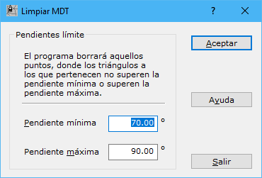

# Borrar triángulos por pendientes

[Borrar triángulos del TIN](/mdtopx/fichas-de-herramientas/ficha-de-herramientas-edicion-tin/borrar-triangulos-del-tin.md)

Esta herramienta permite eliminar del [modelo digital](../como/como-triangulacion.md)triángulos que no están en el umbral de pendientes que indique el usuario. Para ello el programa necesita que se le indique una pendiente mínima por debajo de la cual, se pueden eliminar triángulos y una pendiente máxima, por encima de la cual, también se eliminará el triángulo.

Al llamar a la herramienta se muestra un cuadro de diálogo, donde se indicarán la pendiente máxima y la mínima. Si no se desea eliminar ningún triángulo en zonas llanas, se indicará en el campo Pendiente mínima el valor 0 y si no se desea eliminar ningún triángulo de pendiente elevada, se indicará en el campo Pendiente máxima el valor 90.

Los valores de la pendiente se indicarán en grados sexagesimales.
