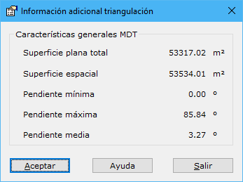
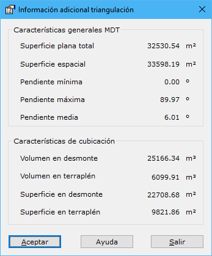

# Información adicional de triangulación

[ Vista TIN](../fichas-de-herramientas/ficha-de-herramientas-edicion-tin/vista-tin.md)

En este cuadro de diálogo se muestran algunas características acerca de la morfología del [modelo digital del terreno](../como/como-triangulacion.md). Estas características son las siguientes:

* **Características generales**:
  * _Superficie plana_: Se muestra la extensión en metros cuadrados del modelo digital, obtenida de la suma de la superficie de cada uno de los triángulos en el plano XY.
  * _Superficie espacial_: Se muestra la extensión en metros cuadrados del modelo digital, obtenida de la suma de la superficie de cada uno de los triángulos en el espacio, es decir, teniendo en cuenta la cota de los puntos.
  * _Pendiente mínima y máxima_: Límites de las pendientes calculadas en grados sexagesimales en todos los triángulos del modelo digital.
  * _Pendiente media_

* **Características de cubicación**: Estas características sólo se mostrarán si el modelo digital es un documento de [cubicación](../como/como-cubicacion.md).
  * _Volumen en desmonte y terraplén_: Volumen en metros cúbicos que está en desmonte o terraplén, obtenido a partir de la suma de los volúmenes calculados en todos los triángulos del modelo. Será desmonte si las cotas de los puntos son negativas o terraplén si son positivas.
  * _Superficie en desmonte y terraplén_: Extensión que ocupan las zonas de desmonte y terraplén en metros cuadrados.
