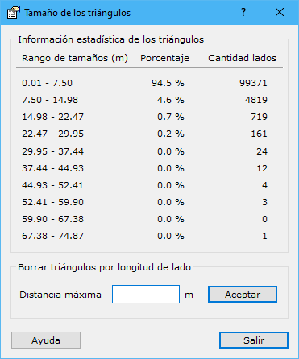

# Tamaño de los lados

[Borrar triángulos del TIN](/mdtopx/fichas-de-herramientas/ficha-de-herramientas-edicion-tin/borrar-triangulos-del-tin.md)

Esta herramienta permite mostrar información acerca del tamaño de los lados de los triángulos y poder borrar aquellos triángulos que tengan lados superiores en longitud a un cierto límite. Muestra un cuadro de diálogo, donde se muestran 10 niveles de tamaños de lados, expresando su cantidad y el porcentaje de cada rango.

Indicando un valor en metros en el campo **Distancia máxima** y pulsando el botón **Borrar** se borrarán aquellos triángulos que tengan algún lado superior a esta magnitud. A continuación, se actualizarán los datos con los triángulos que han permanecido, pudiendo volver a borrar de nuevo.

Esta herramienta tiene la posibilidad de ser ejecutada desde la [línea de comandos](../desde-linea-de-comando/linea-de-comando-borrar-triangulos-por-longitud-de-lado.md).
