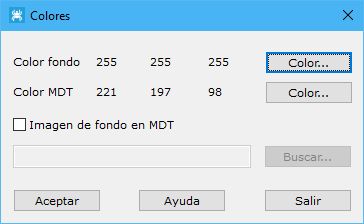

# Color de fondo

[Ficha de herramientas Inicio](/mdtopx/fichas-de-herramientas/ficha-de-herramientas-inicio/)

En este cuadro de diálogo se podrá seleccionar el color de fondo y de MDT. Además, se podrá seleccionar una imagen para visualizar como fondo cuando se tenga abierto un modelo digital.

Los campos son los siguientes:

* **Color fondo**: Se podrá elegir el color de fondo de los documentos abiertos. Esto también puede ser realizado con el comando Color de fondo  de la [Ficha de herramientas Inicio](/mdtopx/fichas-de-herramientas/ficha-de-herramientas-inicio/)
* **Color MDT**: Se podrá elegir el color de fondo de los documentos abiertos. Esto también puede ser realizado con el comando Color de MDT  del menú [Superficie](vista-de-superficie-de-mdt.md)de la [Ficha de Herramientas MDT](/mdtopx/fichas-de-herramientas/ficha-de-herramientas-mdt/)
* **Imagen de fondo en MDT**: Si se desea, se podrá elegir una imagen ráster como fondo para los documentos de modelos digitales abiertos.

