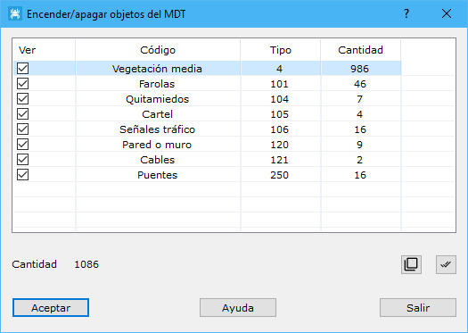

# Encender/apagar objetos del MDT

[Herramientas MDT Vista de MDT](../fichas-de-herramientas/ficha-de-herramientas-mdt/vista-de-mdt.md)

Mediante este cuadro de diálogo se podrán encender o apagar objetos que estén registrados sobre el modelo digital actual. Por tanto, para poder estar activa, se necesita un documento de modelo digital de triangulación que tenga objetos.

El cuadro de diálogo incluye una lista con los objetos contenidos con la siguiente información:

* **Ver**: Casilla para encender o apagar los objetos de este tipo
* **Código**: Descripción del tipo de objeto, extraído de la [Lista de códigos LiDAR](../modulo-laser/vista/lista-de-clasificaciones.md)
* **Tipo**: Código numérico del tipo de objeto
* **Cantidad**: Número de objetos encontrados de este tipo

Vea también:

* [Objetos MDT](/mdtopx/fichas-de-herramientas/ficha-de-herramientas-edicion-tin/objetos-mdt.md)
