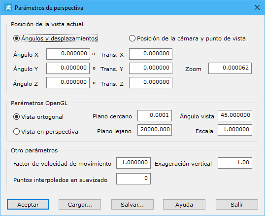

# Parámetros de perspectiva

[Ficha de herramientas Inicio](/mdtopx/fichas-de-herramientas/ficha-de-herramientas-inicio/)

En este cuadro de diálogo se podrá seleccionar una visualización diferente para un archivo. Para ello se deberán indicar los siguientes parámetros:

* **Posición de la vista actual**: Se podrá indicar numéricamente la posición de la vista actual. Esta posición puede ser modificada gráficamente con las herramientas de Zoom de la [Ficha de herramientas Inicio](/mdtopx/fichas-de-herramientas/ficha-de-herramientas-inicio/). Podrá ser indicada de dos formas diferentes:
  * **Ángulos y desplazamientos**: La primera forma de definir la vista es mediante la posición del objeto respecto de los ejes cartesianos. Sus parámetros serían:
    * _Ángulo X_: Giro de la vista sobre el eje X
    * _Ángulo Y_: Giro de la vista sobre el eje Y
    * _Ángulo Z_: Giro de la vista sobre el eje Z
    * _Trans. X_: Desplazamiento de la vista respecto al eje X
    * _Trans. Y_: Desplazamiento de la vista respecto al eje Y
    * _Trans. Z_: Desplazamiento de la vista respecto al eje Z
    * _Zoom_: Nivel de acercamiento
  * **Posición de la cámara y puntos de vista**: La segunda forma de definir la vista sería como si el usuario tuviera una cámara y estuviera apuntando a un determinado punto de vista. Sus parámetros serían:
    * _Cámara X_: Coordenada X de la cámara.
    * _Cámara Y_: Coordenada Y de la cámara.
    * _Cámara Z_: Coordenada Z de la cámara.
    * _Vista X_: Coordenada X del punto al que está apuntando la cámara.
    * _Vista Y_: Coordenada Y del punto al que está apuntando la cámara.
    * _Vista Z_: Coordenada Z del punto al que está apuntando la cámara.
    * _Vertical X_: Componente X del vector que define la verticalidad de la cámara.
    * _Vertical Y_: Componente Y del vector que define la verticalidad de la cámara.
    * _Vertical Z_: Componente Z del vector que define la verticalidad de la cámara.
* **Parámetros OpenGL**:
  * _Tipo de vista_: Se podrá elegir entre _Vista ortogonal_ o _Vista en perspectiva_. Esta elección puede ser llevada a cabo con los comandos Vista ortogonal  y Vista oblicua  de la [Ficha de herramientas Inicio](/mdtopx/fichas-de-herramientas/ficha-de-herramientas-inicio/)
  * _Plano cercano_: Distancia del usuario al primer plano visible.
  * _Plano lejano_: Distancia del usuario al último plano visible.
  * _Ángulo vista_: Ángulo de vista en el eje perpendicular a la pantalla en grados sexagesimales.
  * _Escala_: Factor de escala para exageración de tamaño.
* **Otros parámetros**:
  * _Factor de velocidad de movimiento_: Factor para modificar el movimiento en pantalla.
  * _Exageración vertical_: Escala vertical para exageración del relieve.
  * _Puntos interpolados en suavizado_: Número de puntos a visualizar cuando el modelo digital de rejilla está suavizado.

Todos estos parámetros pueden ser cargados o salvados en archivos ASCII, mediante los botones **Cargar** y **Salvar**, respectivamente.
