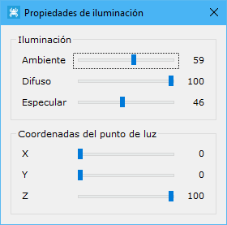

# Propiedades de iluminación

[Ficha de herramientas Inicio](/mdtopx/fichas-de-herramientas/ficha-de-herramientas-inicio/)

Este cuadro de diálogo está destinado a la edición de la iluminación que recibe un modelo digital. Se podrán modificar los valores de la luz y las coordenadas del punto de luz. Sólo se podrá acceder a este cuadro de diálogo si se tiene activo un modelo digital.

Los parámetros que se muestran se mueven en un rango de valor de cero a cien y son los siguientes:

* **Iluminación**:
  * _Ambiente_: Intensidad de luz ambiente. Es el color ambiente y corresponde a la parte no iluminada de un material. Es muy normal que sea el mismo que el difuso.
  * _Difuso_: Intensidad de luz difusa. El color difuso es el que emite un material iluminado.
  * _Especular_: Intensidad de luz especular.
* **Coordenadas del puntos de luz**: Se podrá mover el punto de luz dando valores a las coordenadas X, Y y Z.

Este cuadro de diálogo se mantiene abierto mientras no lo cierre expresamente, pudiendo seguir manipulando el documento.

Vea también:

* [Propiedades de material](/mdtopx/herramientas-de-visualizacion/propiedades-de-material.md)
