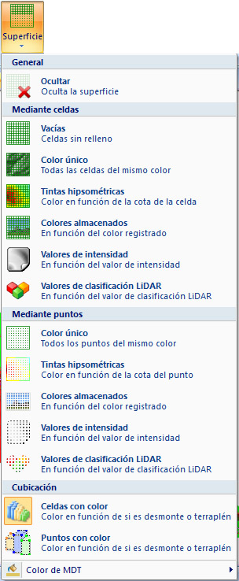

# Vista de Superficie de MDT

[Herramientas MDT Vista de MDT](../fichas-de-herramientas/ficha-de-herramientas-mdt/vista-de-mdt.md)

El usuario puede elegir entre varias opciones para visualizar el modelo digital del terreno. Para estar activas, el documento actual deberá ser un modelo digital o tener modelos digitales como archivos de referencia. Las opciones disponibles son las siguientes:

* **Ocultar**: No muestra información gráfica del modelo digital.
* **Mediante celdas**: Muestra la información gráfica del modelo digital mediante las celdas o triángulos que lo conforman. Hay tres opciones:
  * _Vacías_: Se mostrarán las celdas sin relleno de color, como una malla de alambre. El color de las celdas se puede cambiar mediante la opción Color de MDT de este mismo listado.
  * _Color único_: Se mostrarán las celdas con relleno de color, dando sensación de superficie continua al ocurrir ocultación de elementos. El color de las celdas se puede cambiar mediante la opción Color de MDT de este mismo listado.
  * _Tintas hipsométricas_: Se mostrarán las celdas rellenas de color. Este color será función de la altitud de cada punto que conforme las celda. Al seleccionar esta opción el programa muestra un [cuadro de diálogo](../otras-herramientas/seleccionar-gama-de-color.md)para poder elegir la gama de color a utilizar.
  * _Colores almacenados_: Esta opción permite visualizar el MDT mediante los triángulos que lo conforman, asignándoles un color en función del color almacenado que tuvieran los puntos. Para ello los puntos deberían tener el color asignado antes de calcular el MDT, propio de nubes de puntos LiDAR.
  * _Intensidad_: Esta opción permite visualizar el MDT mediante los triángulos que lo conforman, asignándoles un color en función del valor de intensidad almacenado que tuvieran los puntos, propio de nubes de puntos LiDAR.
  * _Clasificación_: Esta opción permite visualizar el MDT mediante los triángulos que lo conforman, asignándoles un color en función del tipo de clasificación almacenado que tuvieran los puntos, propio de nubes de puntos LiDAR.
* **Mediante puntos**: Muestra la información gráfica del modelo digital mediante las puntos que lo conforman. Hay dos opciones:
  * _Color único_: Se mostrarán los puntos de color, como una nube de puntos. El color de las puntos se puede cambiar mediante la opción Color de MDT de este mismo listado.
  * _Tintas hipsométricas_: Se mostrarán los puntos con un color que será función de la altitud de cada uno de ellos. Al seleccionar esta opción el programa muestra un [cuadro de diálogo](../otras-herramientas/seleccionar-gama-de-color.md)para poder elegir la gama de color a utilizar.
  * _Colores almacenados_: Esta opción permite visualizar el MDT mediante los vértices que lo conforman, asignándoles un color en función del color almacenado que tuvieran los puntos. Para ello los puntos deberían tener el color asignado antes de calcular el MDT, propio de nubes de puntos LiDAR.
  * _Intensidad_: Esta opción permite visualizar el MDT mediante los vértices que lo conforman, asignándoles un color en función del valor de intensidad almacenado que tuvieran los puntos, propio de nubes de puntos LiDAR.
  * _Clasificación_: Esta opción permite visualizar el MDT mediante los vértices que lo conforman, asignándoles un color en función del tipo de clasificación almacenado que tuvieran los puntos, propio de nubes de puntos LiDAR.
* **Cubicación**: Si el modelo digital almacena los valores de una cubicación, se muestran dos opciones más donde el color de los elementos depende de si están en desmonte o terraplén, es decir, cota negativa o cota positiva. El color será rojo en caso de terraplén, verde en caso de desmonte y azul si la cubicación es cero. Hay dos opciones:
  * _Celdas con color_: Se mostrarán las celdas rellenas del color de cubicación que les corresponda.
  * _Puntos con color_: Se mostrarán los puntos del color de cubicación que les corresponda.
* **Color de MDT**: Desde esta opción se podrá elegir el color que se utilizará para visualizar el modelo digital cuando la opción sea el color único o celdas vacías . Este color también puede ser seleccionado desde el comando [Fondo](color-de-fondo.md)de la [Ficha de herramientas Inicio](/mdtopx/fichas-de-herramientas/ficha-de-herramientas-inicio/).
