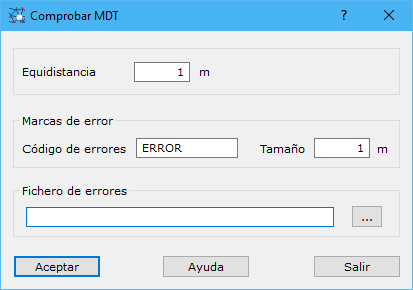

# Comprobar MDT

[Herramientas MDT Productos civil](../fichas-de-herramientas/ficha-de-herramientas-mdt/productos-civil.md)

La aplicación permite comprobar la altimetría de un fichero con un modelo digital del terreno. Para ello, es necesario que el modelo digital sólo contenga curvas de nivel y puntos acotados. Además, las curvas de nivel deberían haber sido introducidas como líneas de ruptura. El programa buscará la ausencia de curvas de nivel, curvas de nivel con cota errónea, puntos acotados mal colocados, etc.

En este cuadro de diálogo aparecen los siguientes campos a rellenar:

* **Equidistancia**: Distancia altimétrica entre dos curvas de nivel finas consecutivas. Se indicará en metros.
* **Código de errores**: Código en el que los errores serán almacenados en el fichero de salida.
* **Tamaño del error**: Tamaño en metros en el que serán almacenadas las marcas de error en el fichero de salida.
* **Fichero de errores**: Se indicará un nombre de archivo donde se almacenarán los errores. Se puede pulsar el botón a la derecha para indicar la ubicación del archivo. Este fichero podrá ser en formato de:
  * DIGI para lo cual se indicará la extensión BIN.
  * AutoCad para lo cual se indicará la extensión DXF.
  * MicroStation para lo cual se indicará la extensión DGN.

Para poder utilizar esta herramienta es necesario tener activo un documento de tipo modelo digital de triangulación.
