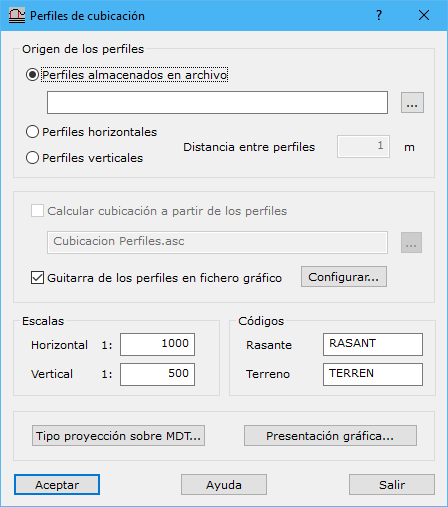

# Perfiles de cubicación

[Cuadro de diálogo Cubicación](./)

Este cuadro de diálogo está destinado a configurar los perfiles que se trazarán cuando se realizan cubicaciones. Se pueden realizar perfiles a partir de elementos registrados en un archivo de dibujo o automáticamente a partir de las dimensiones de la zona de cubicación. Asimismo, es posible obtener el valor de cubicación a partir del superficiado de los perfiles, en caso de que estos sean los generados automáticamente por el programa.

En él aparecen los siguientes campos a rellenar:

* **Origen de los perfiles**: Se deberá indicar de dónde se toman los perfiles que se proyectarán sobre los modelos digitales.
  * _Perfiles almacenados en archivo_: Fichero de dibujo que contiene los perfiles que se han de proyectar. El formato de este fichero puede ser BIN de DIGI, DXF de AutoCad, DGN de MicroStation o un fichero ASCII con las coordenadas que forman los perfiles. Podrán estar almacenados varios perfiles, excepto en el caso del fichero de formato ASCII en el que sólo se leerá uno.
  * _Perfiles horizontales_: El programa calcula automáticamente la posición de perfiles horizontales separados la distancia indicada a partir de las dimensiones de la zona de cubicación
  * _Perfiles verticales_: El programa calcula automáticamente la posición de perfiles verticales separados la distancia indicada a partir de las dimensiones de la zona de cubicación
* **Calcular cubicación**: Si el origen de los perfiles seleccionado fue perfiles horizontales o verticales, el programa permitirá poder calcular el valor de la cubicación a partir del superficiado de dichos perfiles. Este valor se podrá comparar con el valor que se calcule por medio de triángulos o rejilla. Al activarlo se pide al usuario que indique el nombre de un archivo ASCII donde se almacenarán los datos calculados.
* **Guitarra**: Se activará esta casilla si se desean sacar los perfiles longitudinales dentro de una guitarra informativa. Para configurar dicha guitarra se deberá pulsar el botón [Configurar](../perfiles/guitarra.md).
* **Escalas**: Se indicarán los denominadores de escala horizontal y vertical. Servirá para saber el nivel de generalizado de los perfiles y la relación entre un eje y otro de presentación.
* **Códigos**: Se indicarán los códigos para la línea que representa la rasante y la que representa el terreno.
* ****[**Tipo de proyección sobre MDT**](../perfiles/tipo-de-proyeccion.md): Para indicar cómo se deberán proyectar los perfiles sobre el modelo digital.
* ****[**Presentación gráfica**](../perfiles/presentacion-grafica.md): Para indicar cómo deberán ser presentados los perfiles en el fichero final de dibujo.
