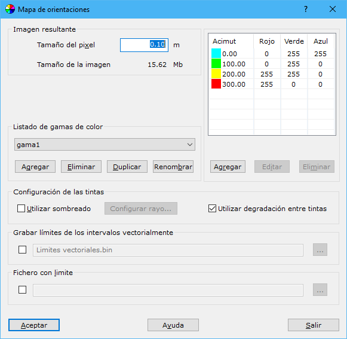

# Mapa de Orientaciones

[Mapa de orientaciones](/mdtopx/como/como-mapa-de-orientaciones.md)

En este cuadro de diálogo aparecen los siguientes campos a rellenar:

* **Tamaño del píxel**: Tamaño en metros de los píxeles que formarán el mapa ráster de orientaciones. Cuanto más grande sea el tamaño del píxel peor calidad de imagen se obtendrá, aunque no es recomendable dar un tamaño demasiado pequeño por el aumento de espacio necesario en memoria y disco para el archivo.
* **Nombre de la gama**: Nombre de la gama de colores a utilizar. Las tablas podrán ser añadidas, eliminadas o duplicadas con otro nombre, para ser utilizadas en diferentes archivos.
* **Tabla de intervalos de acimut**: Se podrán establecer en esta tabla la relación entre colores y diferentes acimuts. Los intervalos podrán ser Añadidos, Eliminados o Editados. El acimut se indicará en grados centesimales.
* **Utilizar sombreado**: Si se selecciona esta opción, se generará un mapa de orientaciones combinado con un sombreado oblicuo del modelo digital, para representar con mayor realidad el relieve. El sombreado oblicuo será calculado con color negro. Para más información, ver la utilidad [Sombreado](/mdtopx/desde-linea-de-comando/linea-de-comando-sombreado.md).
* **Configurar rayo**: En el caso de elegir Utilizar sombreado, éstas podrán ser configuradas desde este [cuadro de diálogo](sombreado/configurar-rayo.md)
* **Utilizar degradación entre tintas**: Esta opción indica al programa que promedie el valor de los colores para cada valor de orientación calculado, de tal forma, que se produce una transición entre los diferentes intervalos de color. Con esta opción se obtienen resultados visualmente aceptables, pero imposibilita saber el rango de orientaciones en las que se encuentra un punto por el color, ya que no se producen colores puros, si no mezclas.
* **Grabar límites de los intervalos vectorialmente**: Esta opción permite al usuario grabar los límites entre los intervalos seleccionados vectorialmente, de tal manera, que se podrían colorear con algún otro programa, ya que se generar superficies cerradas. Se puede pulsar el botón a la derecha para indicar la ubicación del archivo. Este fichero podrá ser en formato de:
  * DIGI para lo cual se indicará la extensión BIN.
  * AutoCad para lo cual se indicará la extensión DXF.
  * MicroStation para lo cual se indicará la extensión DGN.
* **Fichero con límite**: Se podrá utilizar un fichero con el límite de la zona de la cuál se desea el mapa de orientaciones. El formato de este fichero puede ser BIN de DIGI, DXF de AutoCad, DGN de MicroStation o un fichero ASCII con las coordenadas que forman el límite. El límite podrá estar compuesto por una o varias líneas cerradas. En el caso del fichero ASCII sólo podrá ser leída una línea.

Para poder utilizar esta herramienta es necesario tener activo un documento de tipo modelo digital de triangulación.
