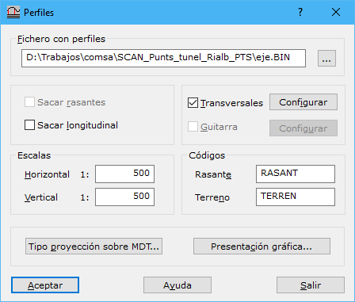

# Perfiles

[Perfiles](/mdtopx/desde-linea-de-comando/linea-de-comando-perfiles.md)

En este cuadro de diálogo aparecen los siguientes campos a rellenar:

* **Fichero con perfiles**: Fichero de dibujo que contiene los perfiles que se han de proyectar. El formato de este fichero puede ser BIN de DIGI, DXF de AutoCad, DGN de MicroStation o un fichero ASCII con las coordenadas que forman los perfiles. Podrán estar almacenados varios perfiles, excepto en el caso del fichero de formato ASCII en el que sólo se leerá uno.
* **Sacar rasante**: Se activará esta casilla si se desea sacar en la guitarra la entidad que dio lugar al perfil, es decir, la rasante. No se activará si únicamente se desea sacar el perfil del terreno.
* **Sacar longitudinal**: Se activará esta casilla si se desean sacar los perfiles longitudinales correspondientes. No se activará si no se desean sacar estos, por ejemplo, para obtener únicamente los perfiles transversales.
* **Transversales**: Se activará esta casilla si se desean sacar perfiles transversales a partir de los perfiles longitudinales. Se podrán configurar pulsando el botón [Configurar](perfiles-transversales.md) .
* **Guitarra**: Se activará esta casilla si se desean sacar los perfiles longitudinales dentro de una guitarra informativa. Para configurar dicha guitarra se deberá pulsar el botón [Configurar](guitarra.md).
* **Escalas**: Se indicarán los denominadores de escala horizontal y vertical. Servirá para saber el nivel de generalizado de los perfiles y la relación entre un eje y otro de presentación.
* **Códigos**: Se indicarán los códigos para la línea que representa la rasante y la que representa el terreno.
* ****[**Tipo de proyección sobre MDT**](tipo-de-proyeccion.md): Para indicar cómo se deberán proyectar los perfiles sobre el modelo digital.
* ****[**Presentación gráfica**](presentacion-grafica.md): Para indicar cómo deberán ser presentados los perfiles en el fichero final de dibujo.

Para poder utilizar esta herramienta es necesario tener activo un documento de tipo modelo digital de triangulación.
