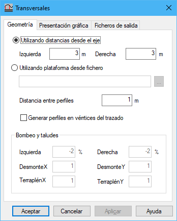
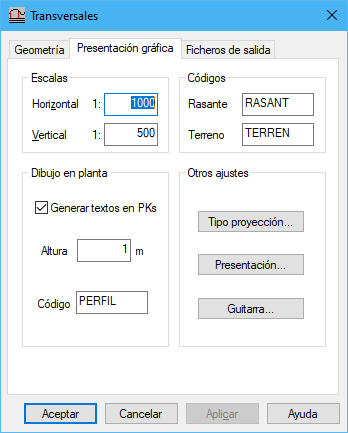
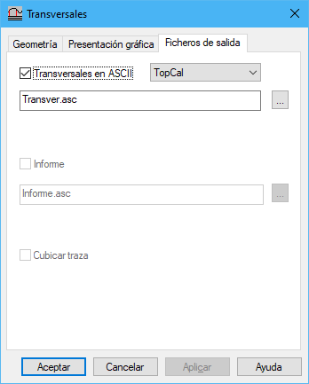

# Perfiles transversales

[Cuadro de diálogo Perfiles](./)

Este cuadro de diálogo se organiza en tres pestañas:

* Geometría
* Presentación gráfica
* Ficheros de salida

### Geometría

En esta pestaña aparecen los siguientes campos a rellenar:

* **Anchura:**
  * _Utilizando distancias desde el eje_: Se indicará la anchura en metros de la rasante, a la izquierda y a la derecha del eje.
  * _Utilizando plataforma desde fichero_
* **Distancia entre perfiles**: Se indicará la distancia en metros entre dos perfiles transversales consecutivos.
* **Generar perfiles en vértices del trazado**
* **Bombeos**: Se indicarán los peraltes en tanto por ciento a izquierda y derecha que tendrá la rasante medidos a partir del eje.
* **Taludes**: Se indicará la relación entre el desplazamiento en X e Y en los taludes para calcular la intersección de la rasante con el terreno, diferenciando entre desmonte y terraplén.

### Presentación gráfica

En esta pestaña aparecen los siguientes campos a rellenar:

* **Escalas**: Se indicarán los denominadores de las escalas vertical y horizontal en las que se registrarán los perfiles dentro del archivo de dibujo.
* **Códigos**: Se indicarán los códigos en los que se registrarán las líneas que representan la rasante y las que representan el terreno.
* **Dibujo en planta**: Elementos en el documento con la planta del vial.
  * _Generar textos de PK_: Se podrá seleccionar esta opción para generar textos en cada perfil transversal con el valor del punto kilométrico.
  * _Altura_: Altura de los textos en metros.
  * _Código_: Código en el que se registrarán los textos.
* **Otros ajustes:**
  * _Tipo proyección sobre MDT_: [Cuadro de diálogo](tipo-de-proyeccion.md) donde se puede configurar el tipo de proyección de los perfiles sobre el modelo digital.
  * _Presentación gráfica_: [Cuadro de diálogo](presentacion-grafica.md) donde se puede configurar la presentación de los perfiles en el archivo salida de dibujo.
  * _Configurar guitarra_: [Cuadro de diálogo](guitarra-de-perfiles-transversales.md) donde se puede configurar la guitarra de los perfiles transversales.

### Ficheros de salida

En esta pestaña aparecen los siguientes campos a rellenar:

* **Fichero de salida ASCII**: Fichero de salida con los perfiles transversales presentando sus puntos con distancias al origen y cotas.
* **Tipo de fichero ASCII**: Formato del fichero ASCII de salida con los perfiles transversales. Este formato podrá ser TopCal , Clip o Genius.
* **Fichero de salida con informe**: Se generará un informe ASCII con los perfiles transversales creados.
* **Cubicar traza**: Si se desea realizar la cubicación de la traza propuesta con el terreno original.
