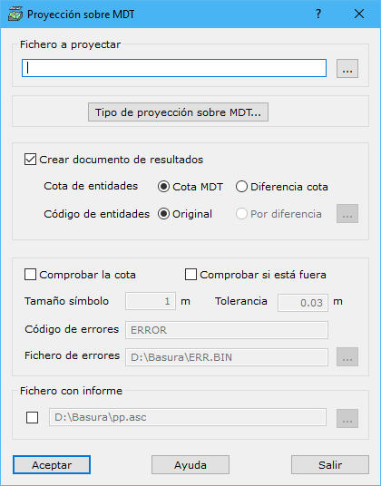

# Proyección sobre MDT

[Herramientas MDT Productos civil](../../fichas-de-herramientas/ficha-de-herramientas-mdt/productos-civil.md)

Desde este cuadro de diálogo el programa puede dar cota a las entidades de un archivo, proyectándolas sobre el modelo digital; o comparar la cota de las dichas entidades con las obtenidas al proyectarlas sobre el modelo digital, permitiendo generar marcas de error en caso de que superen una cierta tolerancia. Para realizar estas operaciones se tienen los siguientes campos a rellenar:

* **Fichero a proyectar**: Se indicarán el nombre del fichero con las entidades que se desean proyectar. Se podrá utilizar el botón situado a la derecha para ejecutar el explorador de Windows para buscar el archivo. El formato de este fichero puede ser BIN de DIGI, DXF de AutoCad, DGN de MicroStation, Shape de ESRI o un fichero ASCII. Podrán estar almacenados varias entidades, excepto en el caso del fichero de formato ASCII en el que sólo se leerá una en forma de línea.
* **Tipo proyección sobre MDT**: [Cuadro de diálogo](../perfiles/tipo-de-proyeccion.md)donde se puede configurar el tipo de proyección de los perfiles sobre el modelo digital.
* **Crear documento de resultados**: Se podrá generar un nuevo documento con el archivo vectorial proyectado. Para ello, habrá que indicar los siguientes datos:
  * _Cota de entidades_: Valor de la Z que se almacenará en cada vértice de cada entidad. Dos opciones:
    * _Cota MDT_: Cota obtenida directamente de la nube de puntos
    * _Diferencia de cota_: Diferencia entre el valor almacenado en el fichero y la proyección sobre la nube de puntos, útil para buscar errores de cota de las entidades
  * _Código de entidades_: Código o capa en el que se almacenarán las entidades vectoriales. Dos opciones:
    * _Original_: No se modifica el código en el que estaba almacenada la entidad originalmente.
    * _Por diferencia_: Se podrá almacenar la entidad con un código diferente en función de la diferencia de cotas (segunda opción del parámetro anterior). La [relación entre el código y la diferencia de cota](codigos-segun-diferencia-de-cota.md)se puede indicar pulsando el botón que está a la derecha.
* **Comprobar la cota**: Se activará esta casilla si se desea comparar la cota que tienen las entidades con las cotas que tendrán después de ser proyectadas sobre el modelo digital.
* **Comprobar si está fuera**: Se activará esta casilla si se desean marcar aquellas entidades que están fueran del límite exterior del modelo digital.
* **Tamaño del símbolo**: Se indicará el tamaño en metros de las marcas generadas para los errores.
* **Tolerancia**: Se indicará la tolerancia en metros que no puede superar la diferencia de cotas en una entidad.
* **Código de errores**: Código en el que se registrarán los errores.
* **Fichero de errores**: Nombre del fichero de errores con extensión donde se almacenarán estos. Se puede pulsar el botón a la derecha para indicar la ubicación del archivo. Este fichero podrá ser en formato de:
  * DIGI para lo cual se indicará la extensión BIN.
  * AutoCad para lo cual se indicará la extensión DXF.
  * MicroStation para lo cual se indicará la extensión DGN.
* **Fichero con informe**: El programa permite sacar un informe con las entidades proyectadas y el error que contenían. Se podrá utilizar el botón situado a la derecha para ejecutar el explorador de Windows para ubicar el archivo.

Para poder utilizar esta herramienta es necesario tener activo un documento de tipo modelo digital de triangulación.
