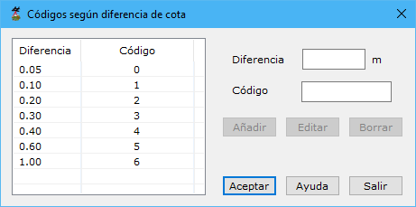

# Códigos según diferencia de cota

Desde este cuadro de diálogo se podrá generar un listado que vincule diferencias de cota con un código determinado. De esta forma, se podrían detectar rápidamente entidades con determinadas diferencia.

Seleccionando un elemento de la lista se podrá **Borrar** o **Editar** utilizando los botones al efecto.

Asimismo, rellenando los campos **Diferencia** y **Código** se podrán **Añadir** elementos nuevos a la lista.

Vea también:

* [Proyección sobre MDT](/mdtopx/herramientas-mdt/proyeccion-sobre-mdt/)
* [Proyección sobre la nube de puntos](/mdtopx/modulo-laser/generar/proyeccion-sobre-la-nube-de-puntos.md)
