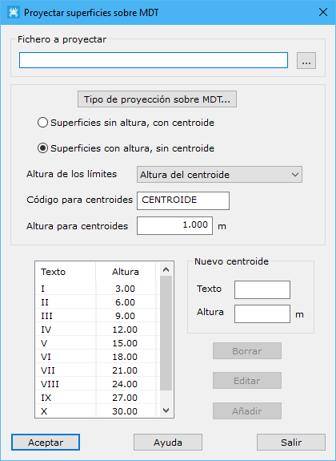

# Proyectar superficies

[Herramientas MDT Productos civil](../fichas-de-herramientas/ficha-de-herramientas-mdt/productos-civil.md)

Herramienta destinada a la proyección de superficies sobre el modelo digital con dos objetivos: Poder elevar la superficie sobre MDT en función del centroide que indica su diferencia de altura o generar un centroide con la altura relativa respecto del MDT.

Al ejecutar el comando aparece un cuadro de diálogo con los siguientes campos:

* **Fichero a proyectar**: Nombre del fichero a proyectar. Deberá ser un fichero con entidades vectoriales cerradas que representan las superficies a proyectar.
* ****[**Tipo de proyección sobre MDT**](perfiles/tipo-de-proyeccion.md): Se podrá elegir cómo proyectar las entidades sobre el MDT.
* **Modo de proyección**: Dos opciones:
  * _Superficies sin altura, con centroide_: No se considerará la cota de las superficies y se proyectarán las entidades sobre el MDT. A continuación, se leerá el centroide de cada entidad y en función de su valor y el listado que se muestra a continuación, se elevará la superficie sobre el MDT.
  * _Superficies con altura, sin centroide_: Las superficies tendrán que tener cota. Estas entidades se proyectarán sobre el MDT y según la diferencia entre ambas altitudes y el listado que se muestra a continuación, se procederá a incluir un centroide con el valor de la altura diferencial.
* **Altura de los límites**: Se podrá elegir cómo determinar la cota de las superficies. Se tienen cuatro opciones:
  * _Altura del centroide_: Se proyectará únicamente el centroide sobre el MDT. Es más rápido, pero si hay mucha pendiente en el MDT, menos preciso.
  * _Máxima altura_: Se proyectarán todos los puntos de las entidades y se elegirá la mayor cota obtenida.
  * _Mínima altura_: Se proyectarán todos los puntos de las entidades y se elegirá la menor cota obtenida.
  * _Altura media_: Se proyectarán todos los puntos de las entidades y se calculará la cota media.
* **Código para centroides**: En caso de generar centroides, código en el que se registrarán.
* **Altura para centroides**: En caso de generar centroides, tamaño de los textos en coordenadas terreno.
* **Listado de centroides**: Relación entre el valor del centroide y la altura respecto del MDT. Por ejemplo, para el caso del catastro español, cada planta de un edificio se representa con un número romano. En el caso del catastro español, no se considerarán los valores de centroide de alturas bajo rasante (que empiezan por el signo menos) o superficies añadidas (que se representan por un signo más, como terrazas o balcones).
* **Nuevo centroide**: Además de los valores incluidos por defecto, se da la posibilidad de incluir, modificar o borrar valores existentes. Para ello se deberá indicar el valor del nuevo centroide y el número de metros de altura sobre el MDT que representa.

<video controls><source src="https://youtu.be/J33Mxf5fAAA" type="video/mp4"></video>
Proyectar superficies sobre modelo digital

Para poder utilizar esta herramienta es necesario tener activo un documento de tipo modelo digital de triangulación.
