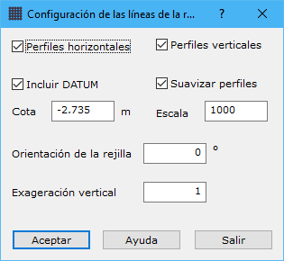

# Configuración de las líneas de la rejilla

[Cuadro de diálogo Rejilla](./)

En este cuadro de diálogo se podrá configurar la rejilla que el programa va a proyectar sobre el modelo digital. La rejilla podrá estar compuesta por perfiles horizontales y/o verticales. En él aparecen los siguientes campos a rellenar:

* **Perfiles horizontales**: Activa o desactiva la generación de líneas horizontales en la rejilla.
* **Perfiles verticales**: Activa o desactiva la generación de líneas verticales en la rejilla.
* **Incluir DATUM**: Activa o desactiva la generación de una línea alrededor de la rejilla y a la altitud especificada en el campo Cota. Este campo es útil si se va a visualizar el fichero desde una perspectiva isométrica, dando un aspecto de porción extraída del terreno.
* **Suavizar perfiles**: Activa o desactiva el suavizado de las líneas resultantes de la rejilla. Se utilizaría el algoritmo de suavizado de Splines cúbicos.
* **Cota**: Altitud en metros del Datum , si éste fue seleccionado...
* **Escala**: Denominador de la escala de la rejilla resultante, necesario para el cálculo del suavizado y generalizado de las líneas.
* **Orientación de la rejilla**: Orientación en grados sexagesimales de las líneas horizontales de la rejilla. La orientación de las líneas verticales será perpendicular a ésta. Si este campo es igual a 0, las líneas verticales estarán orientadas al Norte.
* **Exageración vertical**: Grado de exageración de la altitud de las líneas generadas, útil para realzar el relieve de la zona.
