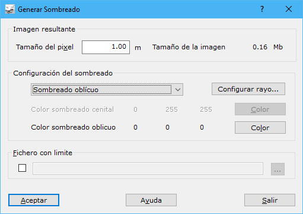

# Sombreado

[Sombreado](/mdtopx/desde-linea-de-comando/linea-de-comando-sombreado.md)

En este cuadro de diálogo aparecen los siguientes campos a rellenar:

* **Tamaño del píxel**: Tamaño en metros de los píxeles que formarán el mapa ráster con el sombreado. Cuanto más grande sea el tamaño del píxel peor calidad de imagen se obtendrá, aunque no es recomendable dar un tamaño demasiado pequeño por el aumento de espacio necesario en memoria y disco para el archivo.
* **Tipo de sombreado**: El tipo de sombreado podrá ser Cenital, Oblicuo o Combinado.
* **Configurar rayo**: Pulsando este botón aparecerá un [cuadro de diálogo](configurar-rayo.md)donde se puede configurar el rayo utilizado para generar un sombreado, cuando éste es de tipo oblicuo o combinado .
* **Color del sombreado cenital**: Color a emplear en la iluminación cenital.
* **Color del sombreado oblicuo**: Color a emplear en la iluminación oblicua.
* **Fichero con límite**: Se podrá utilizar un fichero con el límite de la zona de la cuál se desea el sombreado. El formato de este fichero puede ser BIN de DIGI, DXF de AutoCad, DGN de MicroStation o un fichero ASCII con las coordenadas que forman el límite. El límite podrá estar compuesto por una o varias líneas cerradas. En el caso del fichero ASCII sólo podrá ser leída una línea.

Si se emplea un tipo de sombreado Combinado, es recomendable utilizar colores cálidos para el sombreado cenital (rosas, amarillos...) y colores fríos para el sombreado oblicuo (azules, morados...).

Para poder utilizar esta herramienta es necesario tener activo un documento de tipo modelo digital de triangulación.
