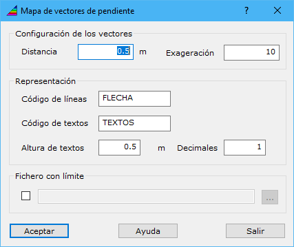

# Vectores de pendiente

[Herramientas MDT Productos civil](../fichas-de-herramientas/ficha-de-herramientas-mdt/productos-civil.md)

Mediante esta herramienta es posible calcular los vectores que definen la pendiente de un modelo digital del terreno. Estos vectores son registrados en un archivo de dibujo mediante una flecha indicativa de la dirección y la magnitud de la pendiente, más un texto con el valor de la pendiente en porcentaje. 

Al ejecutar el comando, aparece un cuadro de diálogo con los siguientes campos:

* **Configuración de los vectores**: Se podrá configurar las líneas que representan la dirección y magnitud de la pendiente, mediante los siguientes parámetros:
  * _Distancia_: Separación de los puntos donde se realizarán los cálculos de la pendiente.
  * _Exageración_: Multiplicador a la magnitud de la pendiente, que condicionará la longitud del vector en el archivo de salida.
* **Representación**: Configuración de las entidades que se incluirán en el documento de salida:
  * _Código de las líneas_: Código para los vectores.
  * _Código de los textos_: Código para los textos con el valor de la pendiente.
  * _Altura de textos_: Tamaño del texto en coordenadas terreno.
  * _Decimales_: Número de decimales a incluir en el valor de la pendiente.
* **Fichero con límite**: Se podrá seleccionar un fichero con entidades vectoriales cerradas que determinen dónde calcular los vectores de pendiente.

Para poder utilizar esta herramienta es necesario tener activo un documento de tipo modelo digital de rejilla.
