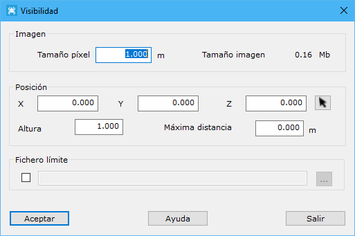

# Visibilidad

[Herramientas MDT Productos ráster](../fichas-de-herramientas/ficha-de-herramientas-mdt/productos-raster.md)

Herramienta para calcular la zona visible desde un determinado punto. La salida es una imagen donde se mostrarán los píxeles de las zonas visibles de color rojo.

Al ejecutarla, se presenta un cuadro de diálogo con los siguientes campos:

* **Imagen**: Configuración de la imagen de salida. Se deberá indicar el tamaño del píxel en metros. Cuanto más grande sea el tamaño del píxel peor calidad de imagen se obtendrá.
* **Posición**: Se podrá indicar la posición del observador mediante sus coordenadas XYZ. Pulsando sobre el botón con el cursor, se podrá seleccionar en pantalla esta posición.
* **Altura**: Se podrá indicar una altura del observador sobre el MDT.
* **Máxima distancia**: Se podrá indicar una distancia máxima de visibilidad. Indicando un cero, no se tendrá en cuenta la lejanía de las zonas.
* **Fichero con límite**: Se podrá seleccionar un fichero con entidades vectoriales cerradas que determinen dónde calcular la visibilidad.

Para poder utilizar esta herramienta es necesario tener activo un documento de tipo modelo digital de triangulación.
