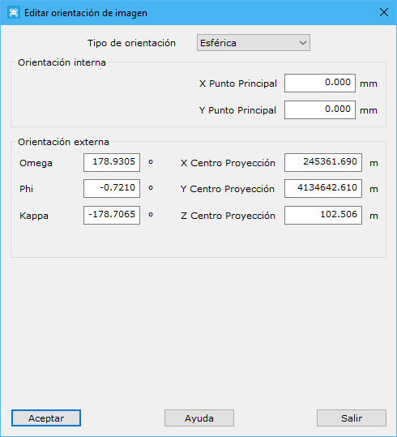

# Editar orientación de imagen

[Orientación](/mdtopx/fichas-de-herramientas/ficha-de-herramientas-imagen/orientacion.md)

Esta herramienta está destinada a la edición de los parámetros de georreferenciación de una imagen. Estos parámetros serán diferentes en función de si la georreferenciación es Orientación ortogonal u Orientación cónica.

Si la orientación de la imagen es ortogonal, se muestra un cuadro de diálogo con los siguientes parámetros:

* **Tamaño píxel**: Se muestra el tamaño del píxel en coordenadas terreno.
* **X esquina NW**: Se muestra la coordenada X en coordenadas terreno de la esquina superior izquierda de la imagen.
* **Y esquina NW**: Se muestra la coordenada Y en coordenadas terreno de la esquina superior izquierda de la imagen.

Si la orientación de la imagen es cónica, se muestra un cuadro de diálogo con los siguientes parámetros:

* Orientación interna:
  * **Focal**: Distancia principal en milímetros.
  * **Tamaño Píxel**: Tamaño del píxel en micras.
  * **X Punto Principal**: Posición X del punto principal en milímetros.
  * **Y Punto Principal**: Posición Y del punto principal en milímetros.
* Orientación externa:
  * **Omega**: Ángulo en torno al eje X, en grados sexagesimales.
  * **Phi**: Ángulo en torno al eje Y, en grados sexagesimales.
  * **Kappa**: Ángulo en torno al eje Z, en grados sexagesimales.
  * **X Centro Proyección**: Coordenada X del centro de proyección en coordenadas terreno.
  * **Y Centro Proyección**: Coordenada Y del centro de proyección en coordenadas terreno.
  * **Z Centro Proyección**: Coordenada Z del centro de proyección en coordenadas terreno.
* **Altura media terreno**: Altitud media del terreno en coordenadas terreno.

Si la imagen es 360º, se muestra un cuadro de diálogo con los siguientes parámetros:

* Orientación interna:
  * **X Punto Principal**: Posición X del punto principal en milímetros.
  * **Y Punto Principal**: Posición Y del punto principal en milímetros.
* Orientación externa:
  * **Omega**: Ángulo en torno al eje X, en grados sexagesimales.
  * **Phi**: Ángulo en torno al eje Y, en grados sexagesimales.
  * **Kappa**: Ángulo en torno al eje Z, en grados sexagesimales.
  * **X Centro Proyección**: Coordenada X del centro de proyección en coordenadas terreno.
  * **Y Centro Proyección**: Coordenada Y del centro de proyección en coordenadas terreno.
  * **Z Centro Proyección**: Coordenada Z del centro de proyección en coordenadas terreno.



Después de georreferenciar la imagen y de salvarla a disco, se generará un archivo ASCII con los parámetros de georreferenciación. Este archivo variará en función del tipo de imagen:

* Para imágenes cónicas o esféricas: El archivo tendrá extensión ORI
* Para imágenes ortogonales: El archivo tendrá extensión ORT. Adicionalmente, en función del formato de salida del archivo:
  * Si se salva en formato TIF, los parámetros de orientación también se almacenarán en la cabecera del archivo imagen y se generará un archivo TFW para su carga en aplicaciones de terceros
  * Si se salva en formato JPEG, se generará un archivo JPW para su carga en aplicaciones de terceros

Un ejemplo de archivo ORI de orientación de imagen esférica sería:

```
[Orientacion]
Modo=Externa
[Externa]
m0=-0.9789410669 -0.2038119630 0.0116220129
m1=-0.2038836663 0.9789805160 -0.0053478801
m2=-0.0102877623 -0.0076047981 -0.9999181611
CentroProyeccion=596407.3353 3125647.8420 82.5872
ZMedia=0.0000
Alcance=0.0000
GPSTime=1299842066.4444465637
ID=2793
TipoOrienta=3
TipoAngulosEsferica=0
CorregirGeodesia=1
MinAltura=0.0000
MaxAltura=180.0000
```

Un ejemplo de archivo ORT de orientación de imagen ortogonal sería:

```
[ort]
Pixel=0.366396
X=446217.550000
Y=4471383.140000
Z=0.000000
EscalaZ=1.000000
```

Un ejemplo de archivo TFW de orientación de la misma imagen ortogonal sería:

```
0.366396
0.000
0.000
-0.366396
446217.550000
4471383.140000
```

Vea también:

* [Orientar midiendo puntos](orientacion-midiendo-puntos.md)
* [Editar orientación de imágenes desde archivo](/mdtopx/herramientas-para-imagenes/editar-orientacion-de-imagenes-desde-archivo.md)
