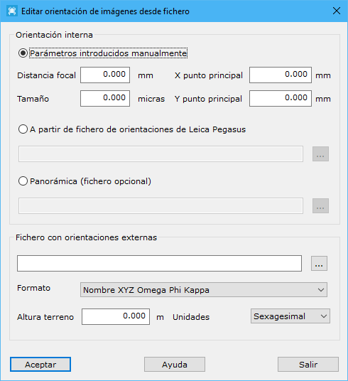

# Editar orientación de imágenes desde archivo

[Orientación](/mdtopx/fichas-de-herramientas/ficha-de-herramientas-imagen/orientacion.md)

Desde esta herramienta se puede editar la orientación de las imágenes contenidas en un [proyecto](/digi3d-net/referencia/linea-de-comandos/proyecto.md). Los parámetros necesarios son los siguientes:

* **Orientación interna**: Tres opciones:
  * _Parámetros introducidos manualmente_: Los parámetros necesarios serían:
    * Distancia focal en mm
    * Tamaño del píxel en micras
    * Fotocoordenada X del punto principal en mm
    * Fotocoordenada Y del punto principal en mm
  * _A partir de fichero de orientaciones de Leica Pegasus_: Orientación interna de imágenes registradas con este sensor.
  * _Panorámica_: Si se elige esta opción, el archivo de orientación interna es opcional
* **Fichero con orientaciones externas**:
  * Nombre del archivo con las orientaciones: Se le deberá indicar el archivo con las orientaciones externas de las imágenes.
  * Formato: Formato del archivo con las orientaciones. Posibilidades:
    * Nombre XYZ Omega Phi Kappa
    * A partir de un fichero de Leica Pegasus
    * A partir de un fichero de FLIR Ladybug
  * Altura del terreno: Para proyectos de imagen aérea. Ignorar si las imágenes son terrestres o MMS.
  * Unidades angulares: Sexagesimal o Centesimal

Vea también:

* [Orientar midiendo puntos](orientacion-midiendo-puntos.md)
* [Editar Orientación](editar-orientacion-de-imagen.md)
