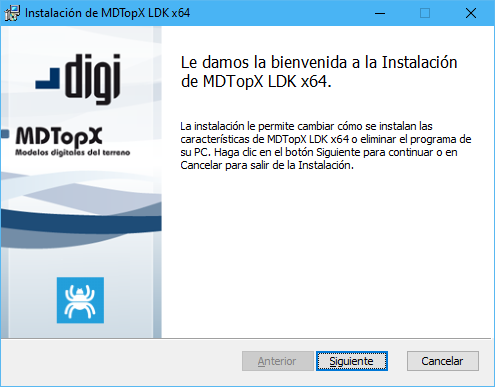
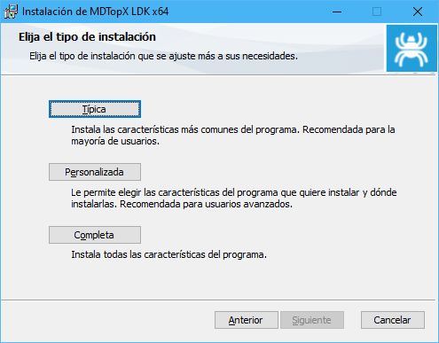
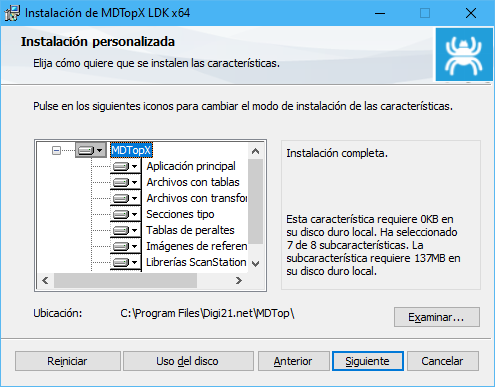

# Instalación del programa

En esta sección se describe cómo instalar MDTopX en el disco duro e iniciar la aplicación. Antes de comenzar, se deberá comprobar que se cumplen los requisitos mínimos indicados en los [Requisitos del sistema](/mdtopx/introduccion/requisitos-del-sistema.md).

* Descargue el archivo de instalación desde [www.digi21.net](https://www.digi21.net/MDTop/Download), que tendrá extensión MSI.
* Ejecute el archivo

* Siga las instrucciones que muestra el programa instalador, que le permitirá especificar el directorio de destino y los módulos opcionales a ser instalados. Estos módulos opcionales son los siguientes:
  * **Típica**: Instala todos los archivos adicionales salvo los ejemplos
  * **Personalizada**: Permite seleccionar los archivos a instalar
  * **Completa**: Instala todos los archivos, incluidos los ejemplos

* Si se elige la opción **Personalizada**, se podrá elegir los archivos a instalar:
  * Aplicación principal
  * Archivos con tablas de códigos
  * Archivos con rejillas de transformación
  * Secciones tipo: Instala un archivo con secciones tipo por defecto. No instale este archivo si tiene secciones tipo creadas por usted. Este archivo se instala en la misma carpeta de instalación del programa y tiene por nombre Secciones tipo.dat.
  * Tablas de peraltes: Instala un archivo con tablas de peraltes por defecto. No instale este archivo si tiene tablas creadas por usted. Este archivo se instala en la misma carpeta de instalación del programa y tiene por nombre Tablas peraltes.dat.
  * Archivo con imágenes de referencia
  * Librería ScanStation
  * Ejemplos

