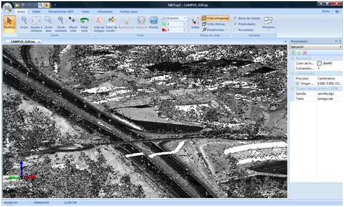

# Interfaz de usuario

El aspecto del programa es el de una aplicación gráfica multi-documento, es decir, le permitirá abrir más de un archivo en cada sesión. En la interfaz se han sustituido las barras de herramientas y menús de usuario por la [cinta de herramientas](../cinta-de-herramientas/). Igualmente el clásico menú Archivo está pulsando el [botón de MDTopX ](boton-de-mdtopx.md)

La interacción del usuario con los elementos de dibujo mostrados se realiza a través del ratón del ordenador. Si el usuario se mueve dentro de la ventana del documento, la aplicación mostrará en la barra de estado las coordenadas de la zona por la cuál está pasando.

Cuando un determinado comando precise de la selección de elementos, ésta se deberá realizar con el botón izquierdo del ratón. Tras lo cual, el programa buscará entidades en el entorno donde actualmente se encuentra el cursor del ratón.

Si encuentra alguna entidad, ésta se iluminará de otro color y el programa pedirá que se confirme la selección para ejecutar la orden (pulsando nuevamente el botón izquierdo del ratón) o que se rechace esta selección para buscar más entidades en la misma zona (pulsando el botón derecho del ratón) o que se finalice la búsqueda (pulsando la tecla \[ESC]).

Si el ratón dispone de rueda central, se puede utilizar para aumentar o reducir el zoom de la vista actual.

En la [barra de estado](barra-de-estado.md)se mostrará información de la herramienta seleccionada, así como mensajes de petición del programa al usuario.

Asimismo, se ofrecen las coordenadas en las que está el cursor. Si el documento actual es un modelo digital del terreno o un dibujo vectorial ofrecerá la coordenada en tiempo real. Si el documento es un archivo ráster ofrecerá el color del píxel.

Por otro lado, en la ventana principal también pueden aparecer una serie de [Paneles de la aplicación](/mdtopx/introduccion/paneles-de-la-aplicacion/) con información de la herramienta actual o del documento actual que tiene activo el usuario. Estos paneles pueden mostrarse u ocultarse a elección del usuario, así como estar fijos en la vista actual u ocultarse automáticamente si no se están utilizando.

El usuario puede cambiar el aspecto del programa seleccionando el estilo deseado (azul, negro, plateado o aguamarina) de la lista mostrada en el menú Estilo . Este menú se encuentra en la esquina superior derecha del interfaz.

A la derecha del menú Estilo, se encuentra el menú de la Ayuda representado por el icono . Este menú tiene las opciones para mostrar la ayuda del programa:

* **Temas de ayuda**: Muestra la ayuda del programa. Si se pulsa un elemento mostrará información acerca de éste. Si se pulsa sobre un lugar cualquiera de la pantalla mostrará información general del programa. También se puede visualizar pulsando la tecla F1.
* **Acerca de MDTopX**: Muestra información acerca de la versión de MDTopX. Se podrá ver cuándo fue compilada la versión que se tiene instalada y la fecha hasta la cual se tiene Servicio Técnico y de actualizaciones disponible. Pasada esta fecha, no se deberán instalar versiones más modernas del programa, puesto que no funcionarán con la licencia actual. Además, se dispone de un botón para comprobar si existen versiones más modernas en el servidor de Digi21.

&#x20;Vea también:

* [¿Qué es MDTopX?](mdtopx.md)
