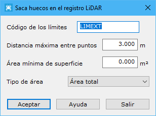

# Buscar huecos

[Ficha de herramientas Clasificar LiDAR](/mdtopx/fichas-de-herramientas/ficha-de-herramientas-clasificar-lidar.md)

Herramienta para generar entidades vectoriales con los huecos encontrados en el registro LiDAR. Es útil para determinar zonas cubiertas por agua, donde el láser no rebota, por ejemplo, estanques, piscinas, etc.

El cuadro de diálogo tiene los siguientes campos:

* **Código de los límites**: Código con el que se registrarán las entidades vectoriales que defines los huecos encontrados.
* **Distancia máxima entre puntos**: Distancia máxima para considerar dos puntos como adyacentes o vecinos en el terreno. Este parámetro dependerá de la densidad de puntos. No es adecuado poner un valor demasiado elevado porque ello provocará que se consideren puntos muy alejados del punto en consideración. Si se indica un valor demasiado escaso, no se podrá relacionar el punto en consideración con ningún otro punto.
* **Área mínima de superficie**: Para identificar huecos correctamente, se puede indicar un valor mínimo de superficie. Por debajo de este valor, la zona no se considerará hueco. Igualmente, se podrá indicar qué **tipo de área** es.

Vea también:

* [Buscar puntos elevados](/mdtopx/modulo-laser/buscar-puntos/buscar-puntos-elevados.md)
* [Buscar puntos aislados](/mdtopx/modulo-laser/buscar-puntos/buscar-puntos-aislados.md)
* [Buscar puntos aéreos](/mdtopx/modulo-laser/buscar-puntos/buscar-puntos-aereos.md)
* [Buscar puntos hundidos](/mdtopx/modulo-laser/buscar-puntos/buscar-puntos-hundidos.md)
* [Buscar puntos por diferencia de intensidad](/mdtopx/modulo-laser/buscar-puntos/buscar-puntos-por-diferencia-de-intensidad.md)
* [Buscar puntos según línea de vuelo](/mdtopx/modulo-laser/buscar-puntos/buscar-puntos-segun-linea-de-vuelo.md)
* [Buscar puntos según Geometría más RGB](buscar-puntos-segun-geometria-mas-rgb.md)
* [Buscar puntos según Geometría más intensidad](buscar-puntos-segun-geometria-mas-intensidad.md)
* [Buscar puntos en Superficies Planas](/mdtopx/modulo-laser/buscar-puntos/buscar-puntos-en-superficies-planas.md)
* [Buscar puntos en Paredes](/mdtopx/modulo-laser/buscar-puntos/buscar-puntos-en-paredes.md)
* [Buscar puntos Solo Suelo](solo-suelo.md)
* [Superficie mágica](/mdtopx/modulo-laser/buscar-puntos/superficie-magica/)
* [Buscar puntos vecinos](buscar-vecinos.md)
* [Buscar puntos según infrarrojo](/mdtopx/modulo-laser/buscar-puntos/buscar-puntos-segun-infrarrojo.md)
* [Buscar puntos según Área de superficie](buscar-puntos-segun-area.md)
* [Buscar puntos según planos de usuario](../formas-geometricas/buscar-puntos-sobre-planos.md) 
