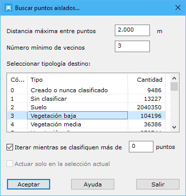

# Buscar puntos aislados

[Ficha de herramientas Clasificar LiDAR](/mdtopx/fichas-de-herramientas/ficha-de-herramientas-clasificar-lidar.md)

Esta herramienta está destinada a la búsqueda y clasificación de puntos LiDAR que se encuentren aislados, no encontrándose ningún punto cerca de su entorno, normalmente porque estos puntos tienen un valor de cota erróneo.

Los parámetros que precisa son los siguientes:

* **Distancia máxima entre puntos**: Distancia máxima para considerar dos puntos como adyacentes o vecinos en el terreno. Este parámetro dependerá de la densidad de puntos. No es adecuado poner un valor demasiado elevado porque ello provocará que se consideren puntos muy alejados del punto en consideración. Si se indica un valor demasiado escaso, no se podrá relacionar el punto en consideración con ningún otro punto.
* **Número mínimo de vecinos**: Número mínimo de puntos que se tienen que encontrar en el entorno del punto en cuestión para considerar que un punto no es aislado.
* **Tipología destino**: Se deberá elegir la tipología de clasificación destino de los puntos que cumplan con las condiciones del cálculo.
* **Iterar mientras se clasifiquen más de x puntos**: El proceso de clasificación puede mejorar si se realizan iteraciones. Por ello, se puede indicar una cantidad mínima de puntos por encima de la cual el programa automáticamente repite el proceso. Por tanto, estas iteraciones se detendrán cuando no se clasifiquen más puntos de los indicados en este campo.
* **Actuar sólo en la selección actual**: Se podrá activar esta opción para calcular sólo en los puntos que actualmente se tengan seleccionados.

El programa comenzará a procesar el archivo actual e irá mostrando los resultados parciales sobre el [panel de Resultados](../../introduccion/paneles-de-la-aplicacion/panel-resultados.md)del programa. Si desea **Cancelar** el proceso el programa le preguntará si desea conservar los cálculos generados hasta ese momento.

Vea también:

* [Buscar puntos elevados](/mdtopx/modulo-laser/buscar-puntos/buscar-puntos-elevados.md)
* [Buscar puntos aéreos](/mdtopx/modulo-laser/buscar-puntos/buscar-puntos-aereos.md)
* [Buscar puntos hundidos](/mdtopx/modulo-laser/buscar-puntos/buscar-puntos-hundidos.md)
* [Buscar puntos por diferencia de intensidad](/mdtopx/modulo-laser/buscar-puntos/buscar-puntos-por-diferencia-de-intensidad.md)
* [Buscar puntos según línea de vuelo](/mdtopx/modulo-laser/buscar-puntos/buscar-puntos-segun-linea-de-vuelo.md)
* [Buscar puntos según Geometría más RGB](buscar-puntos-segun-geometria-mas-rgb.md)
* [Buscar puntos según Geometría más intensidad](buscar-puntos-segun-geometria-mas-intensidad.md)
* [Buscar puntos en Superficies Planas](/mdtopx/modulo-laser/buscar-puntos/buscar-puntos-en-superficies-planas.md)
* [Buscar puntos en Paredes](/mdtopx/modulo-laser/buscar-puntos/buscar-puntos-en-paredes.md)
* [Buscar puntos Solo Suelo](solo-suelo.md)
* [Superficie mágica](/mdtopx/modulo-laser/buscar-puntos/superficie-magica/)
* [Buscar puntos vecinos](buscar-vecinos.md)
* [Buscar puntos según infrarrojo](/mdtopx/modulo-laser/buscar-puntos/buscar-puntos-segun-infrarrojo.md)
* [Buscar huecos](/mdtopx/modulo-laser/buscar-puntos/buscar-huecos.md)
* [Buscar puntos según Área de superficie](buscar-puntos-segun-area.md)
* [Buscar puntos según planos de usuario](../formas-geometricas/buscar-puntos-sobre-planos.md)&#x20;
