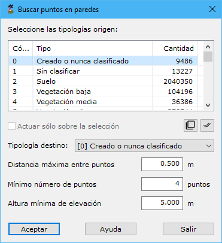

# Buscar puntos en Paredes

[Ficha de herramientas Clasificar LiDAR](/mdtopx/fichas-de-herramientas/ficha-de-herramientas-clasificar-lidar.md)

Esta herramienta está destinada a la búsqueda y clasificación de puntos LiDAR que están situados en superficies verticales, como pueden ser las fachadas de los edificios. Estos puntos suelen ser "no deseados" por lo que se pueden clasificar según alguna tipología accesoria y luego ser eliminados.

Los parámetros que precisa son los siguientes:

* **Seleccione las tipologías origen**: Se deberán seleccionar las tipologías origen donde buscar los puntos situados en paredes.
* **Actuar sólo en la selección actual**: Se podrá activar esta opción para calcular sólo en los puntos que actualmente se tengan seleccionados.
* **Tipología destino**: Se deberá elegir la tipología de clasificación destino de los puntos que cumplan con las condiciones del cálculo.
* **Distancia máxima entre puntos**: Distancia máxima para considerar que los puntos están situados en la misma vertical. No conviene dar un valor muy alto. Se recomienda dar un valor cercano a la precisión planimétrica que pueda tener el LiDAR. Al contrario que en el resto de herramientas, este valor no se corresponde con la densidad de puntos tomados.
* **Mínimo número de puntos**: Cantidad mínima de puntos encontrados sobre la misma vertical para considerar que es una fachada.
* **Altura mínima de elevación**: Altura mínima que tiene que existir entre el punto en consideración con respecto a alguno de sus vecinos para que se cambie su clasificación.

Vea también:

* [Buscar puntos elevados](/mdtopx/modulo-laser/buscar-puntos/buscar-puntos-elevados.md)
* [Buscar puntos aislados](/mdtopx/modulo-laser/buscar-puntos/buscar-puntos-aislados.md)
* [Buscar puntos aéreos](/mdtopx/modulo-laser/buscar-puntos/buscar-puntos-aereos.md)
* [Buscar puntos hundidos](/mdtopx/modulo-laser/buscar-puntos/buscar-puntos-hundidos.md)
* [Buscar puntos por diferencia de intensidad](/mdtopx/modulo-laser/buscar-puntos/buscar-puntos-por-diferencia-de-intensidad.md)
* [Buscar puntos según línea de vuelo](/mdtopx/modulo-laser/buscar-puntos/buscar-puntos-segun-linea-de-vuelo.md)
* [Buscar puntos según Geometría más RGB](buscar-puntos-segun-geometria-mas-rgb.md)
* [Buscar puntos según Geometría más intensidad](buscar-puntos-segun-geometria-mas-intensidad.md)
* [Buscar puntos en Superficies Planas](/mdtopx/modulo-laser/buscar-puntos/buscar-puntos-en-superficies-planas.md)
* [Buscar puntos Solo Suelo](solo-suelo.md)
* [Superficie mágica](/mdtopx/modulo-laser/buscar-puntos/superficie-magica/)
* [Buscar puntos vecinos](buscar-vecinos.md)
* [Buscar puntos según infrarrojo](/mdtopx/modulo-laser/buscar-puntos/buscar-puntos-segun-infrarrojo.md)
* [Buscar huecos](/mdtopx/modulo-laser/buscar-puntos/buscar-huecos.md)
* [Buscar puntos según Área de superficie](buscar-puntos-segun-area.md)
* [Buscar puntos según planos de usuario](../formas-geometricas/buscar-puntos-sobre-planos.md) 
