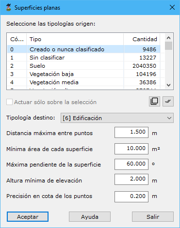

# Buscar puntos en Superficies Planas

[Ficha de herramientas Clasificar LiDAR](/mdtopx/fichas-de-herramientas/ficha-de-herramientas-clasificar-lidar.md)

Esta herramienta está destinada a la búsqueda y clasificación de puntos LiDAR que están situados en superficies planas con una inclinación máxima y una superficie mínima. Es decir, es muy indicada para la búsqueda de puntos que se han medido sobre las cubiertas de los edificios. Antes de ejecutar esta herramienta es recomendable que se clasifiquen los puntos elevados utilizando alguna de las herramientas disponibles al efecto. Con esto se consigue aislar los puntos que tienen una determinada altura y que pueden pertenecer a edificaciones. En los parámetros que se solicitan en el cuadro de diálogo, se deberá seleccionar sólo aquellos puntos que previamente fueron clasificados por ser elevados. Con esto, se evita clasificar puntos que forman superficies planas pero están en el suelo.

Los parámetros que precisa son los siguientes:

* **Seleccione las tipologías origen**: Se deberán seleccionar las tipologías origen donde buscar los puntos que forman la superficie.
* **Actuar sólo en la selección actual**: Se podrá activar esta opción para calcular sólo en los puntos que actualmente se tengan seleccionados.
* **Tipología destino**: Se deberá elegir la tipología de clasificación destino de los puntos que cumplan con las condiciones del cálculo.
* **Distancia máxima entre puntos**: Distancia máxima para considerar dos puntos como adyacentes o vecinos en el terreno. Este parámetro dependerá de la densidad de puntos. No es adecuado poner un valor demasiado elevado porque ello provocará que se consideren puntos muy alejados del punto en consideración. Si se indica un valor demasiado escaso, no se podrá relacionar el punto en consideración con ningún otro punto.
* **Mínima área de cada superficie**: Valor que deberá superar el conjunto de puntos vecinos que cumplen con la condición de ser superficie plana.
* **Máxima pendiente de la superficie**: Valor máximo en grados sexagesimales que no deberá superar la superficie que forman los puntos.
* **Altura mínima de elevación**: Altura mínima que tiene que existir entre el punto en consideración con respecto a alguno de sus vecinos para que se cambie su clasificación.

Vea también:

* [Buscar puntos elevados](/mdtopx/modulo-laser/buscar-puntos/buscar-puntos-elevados.md)
* [Buscar puntos aislados](/mdtopx/modulo-laser/buscar-puntos/buscar-puntos-aislados.md)
* [Buscar puntos aéreos](/mdtopx/modulo-laser/buscar-puntos/buscar-puntos-aereos.md)
* [Buscar puntos hundidos](/mdtopx/modulo-laser/buscar-puntos/buscar-puntos-hundidos.md)
* [Buscar puntos por diferencia de intensidad](/mdtopx/modulo-laser/buscar-puntos/buscar-puntos-por-diferencia-de-intensidad.md)
* [Buscar puntos según línea de vuelo](/mdtopx/modulo-laser/buscar-puntos/buscar-puntos-segun-linea-de-vuelo.md)
* [Buscar puntos según Geometría más RGB](buscar-puntos-segun-geometria-mas-rgb.md)
* [Buscar puntos según Geometría más intensidad](buscar-puntos-segun-geometria-mas-intensidad.md)
* [Buscar puntos en Paredes](/mdtopx/modulo-laser/buscar-puntos/buscar-puntos-en-paredes.md)
* [Buscar puntos Solo Suelo](solo-suelo.md)
* [Superficie mágica](/mdtopx/modulo-laser/buscar-puntos/superficie-magica/)
* [Buscar puntos vecinos](buscar-vecinos.md)
* [Buscar puntos según infrarrojo](/mdtopx/modulo-laser/buscar-puntos/buscar-puntos-segun-infrarrojo.md)
* [Buscar huecos](/mdtopx/modulo-laser/buscar-puntos/buscar-huecos.md)
* [Buscar puntos según Área de superficie](buscar-puntos-segun-area.md)
* [Buscar puntos según planos de usuario](../formas-geometricas/buscar-puntos-sobre-planos.md)

<video controls><source src="https://youtu.be/qm8dz4AmSRQ" type="video/mp4"></video>
Buscar edificios en un archivo LiDAR

