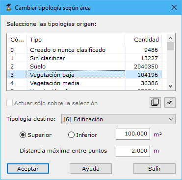

# Buscar puntos según área

 [Ficha de herramientas Clasificar LiDAR](/mdtopx/fichas-de-herramientas/ficha-de-herramientas-clasificar-lidar.md)

Con esta herramienta se pueden clasificar puntos que forman superficies con valores de área superiores o inferiores a un determinado valor.

Los parámetros necesarios son los siguientes:

* **Tipología origen**: Se deberá seleccionar las tipologías que se considerarán en esta clasificación.
* **Actuar sólo en la selección actual**: Se podrá activar esta opción para calcular sólo en los puntos que actualmente se tengan seleccionados
* **Tipología destino**: Se deberá elegir la tipología de clasificación destino de los puntos que cumplan con las condiciones del cálculo.
* **Modo de cálculo**: Se podrán considerar dos maneras para clasificar:
  * _Superior_: Se clasificarán aquellos puntos que formen una superficie cuya área sea superior al valor indicado.
  * _Inferior_: Se clasificarán aquellos puntos que formen una superficie cuya área sea inferior al valor indicado.
* **Distancia máxima entre puntos**: Distancia máxima para considerar dos puntos como adyacentes o vecinos en el terreno. Este parámetro dependerá de la densidad de puntos. No es adecuado poner un valor demasiado elevado porque ello provocará que se consideren puntos muy alejados del punto en consideración. Si se indica un valor demasiado escaso, no se podrá relacionar el punto en consideración con ningún otro punto.

Vea también:

* [Buscar puntos elevados](/mdtopx/modulo-laser/buscar-puntos/buscar-puntos-elevados.md)
* [Buscar puntos aislados](/mdtopx/modulo-laser/buscar-puntos/buscar-puntos-aislados.md)
* [Buscar puntos aéreos](/mdtopx/modulo-laser/buscar-puntos/buscar-puntos-aereos.md)
* [Buscar puntos hundidos](/mdtopx/modulo-laser/buscar-puntos/buscar-puntos-hundidos.md)
* [Buscar puntos por diferencia de intensidad](/mdtopx/modulo-laser/buscar-puntos/buscar-puntos-por-diferencia-de-intensidad.md)
* [Buscar puntos según línea de vuelo](/mdtopx/modulo-laser/buscar-puntos/buscar-puntos-segun-linea-de-vuelo.md)
* [Buscar puntos según Geometría más RGB](buscar-puntos-segun-geometria-mas-rgb.md)
* [Buscar puntos según Geometría más intensidad](buscar-puntos-segun-geometria-mas-intensidad.md)
* [Buscar puntos en Superficies Planas](/mdtopx/modulo-laser/buscar-puntos/buscar-puntos-en-superficies-planas.md)
* [Buscar puntos en Paredes](/mdtopx/modulo-laser/buscar-puntos/buscar-puntos-en-paredes.md)
* [Buscar puntos Solo Suelo](solo-suelo.md)
* [Superficie mágica](/mdtopx/modulo-laser/buscar-puntos/superficie-magica/)
* [Buscar puntos vecinos](buscar-vecinos.md)
* [Buscar puntos según infrarrojo](/mdtopx/modulo-laser/buscar-puntos/buscar-puntos-segun-infrarrojo.md)
* [Buscar huecos](/mdtopx/modulo-laser/buscar-puntos/buscar-huecos.md)
* [Buscar puntos según planos de usuario](../formas-geometricas/buscar-puntos-sobre-planos.md) 
