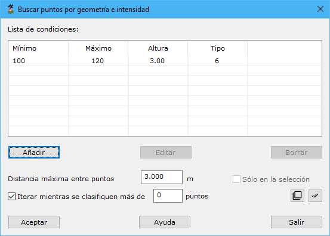

# Buscar puntos según geometría más intensidad

[Ficha de herramientas Clasificar LiDAR](/mdtopx/fichas-de-herramientas/ficha-de-herramientas-clasificar-lidar.md)

Esta herramienta está destinada a la búsqueda y clasificación de puntos LiDAR en función de las propiedades geométricas que un punto tiene con su entorno más el valor de la intensidad que tenga asignado. De esta forma, se puede particularizar sobre ciertos objetos que han tenido una determinada respuesta al láser.

Los parámetros que precisa son los siguientes:

* **Lista de condiciones**: Se deberán añadir las condiciones que deben cumplir los puntos para ser clasificados. Estas condiciones serán composición de un rango de intensidad (definido por un mínimo y un máximo) y un valor mínimo de altura respecto a su entorno. Cada condición añadida podrá tener una tipología destino diferente. Utilice para ello los botones **Añadir**, **Editar** o **Borrar**.
* **Distancia máxima entre puntos**: Distancia máxima para considerar dos puntos como adyacentes o vecinos en el terreno. Este parámetro dependerá de la densidad de puntos. No es adecuado poner un valor demasiado elevado porque ello provocará que se consideren puntos muy alejados del punto en consideración. Si se indica un valor demasiado escaso, no se podrá relacionar el punto en consideración con ningún otro punto.
* **Iterar mientras se clasifiquen más de x puntos**: El proceso de clasificación puede mejorar si se realizan iteraciones. Por ello, se puede indicar una cantidad mínima de puntos por encima de la cual el programa automáticamente repite el proceso. Por tanto, estas iteraciones se detendrán cuando no se clasifiquen más puntos de los indicados en este campo.
* **Actuar sólo en la selección actual**: Se podrá activar esta opción para calcular sólo en los puntos que actualmente se tengan seleccionados.

El programa comenzará a procesar el archivo actual e irá mostrando los resultados parciales sobre el [panel de Resultados](../../introduccion/paneles-de-la-aplicacion/panel-resultados.md)del programa. Si desea **Cancelar** el proceso el programa le preguntará si desea conservar los cálculos generados hasta ese momento.

Vea también:

* [Buscar puntos elevados](/mdtopx/modulo-laser/buscar-puntos/buscar-puntos-elevados.md)
* [Buscar puntos aislados](/mdtopx/modulo-laser/buscar-puntos/buscar-puntos-aislados.md)
* [Buscar puntos aéreos](/mdtopx/modulo-laser/buscar-puntos/buscar-puntos-aereos.md)
* [Buscar puntos hundidos](/mdtopx/modulo-laser/buscar-puntos/buscar-puntos-hundidos.md)
* [Buscar puntos por diferencia de intensidad](/mdtopx/modulo-laser/buscar-puntos/buscar-puntos-por-diferencia-de-intensidad.md)
* [Buscar puntos según línea de vuelo](/mdtopx/modulo-laser/buscar-puntos/buscar-puntos-segun-linea-de-vuelo.md)
* [Buscar puntos según Geometría más RGB](buscar-puntos-segun-geometria-mas-rgb.md)
* [Buscar puntos en Superficies Planas](/mdtopx/modulo-laser/buscar-puntos/buscar-puntos-en-superficies-planas.md)
* [Buscar puntos en Paredes](/mdtopx/modulo-laser/buscar-puntos/buscar-puntos-en-paredes.md)
* [Buscar puntos Solo Suelo](solo-suelo.md)
* [Superficie mágica](/mdtopx/modulo-laser/buscar-puntos/superficie-magica/)
* [Buscar puntos vecinos](buscar-vecinos.md)
* [Buscar puntos según infrarrojo](/mdtopx/modulo-laser/buscar-puntos/buscar-puntos-segun-infrarrojo.md)
* [Buscar huecos](/mdtopx/modulo-laser/buscar-puntos/buscar-huecos.md)
* [Buscar puntos según Área de superficie](buscar-puntos-segun-area.md)
* [Buscar puntos según planos de usuario](../formas-geometricas/buscar-puntos-sobre-planos.md)&#x20;
