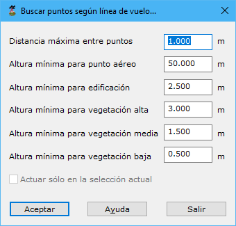

# Buscar puntos según línea de vuelo

[Ficha de herramientas Clasificar LiDAR](/mdtopx/fichas-de-herramientas/ficha-de-herramientas-clasificar-lidar.md)

Esta herramienta está destinada a la búsqueda y clasificación de puntos LiDAR en función de las propiedades geométricas que un punto tiene con los puntos registrados antes o después en el vuelo. Para clasificar, la herramienta precisa de unas diferencias de altitud que se deberán indicar de mayor a menor según los campos que a continuación se explican.

Los parámetros que precisa son los siguientes:

* **Distancia máxima entre puntos**: Distancia máxima para considerar dos puntos como adyacentes o vecinos en el terreno. Este parámetro dependerá de la densidad de puntos. No es adecuado poner un valor demasiado elevado porque ello provocará que se consideren puntos muy alejados del punto en consideración. Si se indica un valor demasiado escaso, no se podrá relacionar el punto en consideración con ningún otro punto.
* **Altura mínima para punto aéreo**: Altura mínima que tiene que existir entre el punto en consideración con respecto a alguno de sus vecinos para que se considere como un punto aéreo.
* **Altura mínima para edificación**: Altura mínima que tiene que existir entre el punto en consideración con respecto a alguno de sus vecinos para que se considere como un punto de edificación.
* **Altura mínima para vegetación alta**: Altura mínima que tiene que existir entre el punto en consideración con respecto a alguno de sus vecinos para que se considere como un punto de vegetación alta.
* **Altura mínima para vegetación media**: Altura mínima que tiene que existir entre el punto en consideración con respecto a alguno de sus vecinos para que se considere como un punto de vegetación media.
* **Altura mínima para vegetación baja**: Altura mínima que tiene que existir entre el punto en consideración con respecto a alguno de sus vecinos para que se considere como un punto de vegetación baja.
* **Actuar sólo en la selección actual**: Se podrá activar esta opción para calcular sólo en los puntos que actualmente se tengan seleccionados.

El programa comenzará a procesar el archivo actual e irá mostrando los resultados parciales sobre el [panel de Resultados](../../introduccion/paneles-de-la-aplicacion/panel-resultados.md)del programa. Si desea **Cancelar** el proceso el programa le preguntará si desea conservar los cálculos generados hasta ese momento.

Vea también:

* [Buscar puntos elevados](/mdtopx/modulo-laser/buscar-puntos/buscar-puntos-elevados.md)
* [Buscar puntos aislados](/mdtopx/modulo-laser/buscar-puntos/buscar-puntos-aislados.md)
* [Buscar puntos aéreos](/mdtopx/modulo-laser/buscar-puntos/buscar-puntos-aereos.md)
* [Buscar puntos hundidos](/mdtopx/modulo-laser/buscar-puntos/buscar-puntos-hundidos.md)
* [Buscar puntos por diferencia de intensidad](/mdtopx/modulo-laser/buscar-puntos/buscar-puntos-por-diferencia-de-intensidad.md)
* [Buscar puntos según Geometría más RGB](buscar-puntos-segun-geometria-mas-rgb.md)
* [Buscar puntos según Geometría más intensidad](buscar-puntos-segun-geometria-mas-intensidad.md)
* [Buscar puntos en Superficies Planas](/mdtopx/modulo-laser/buscar-puntos/buscar-puntos-en-superficies-planas.md)
* [Buscar puntos en Paredes](/mdtopx/modulo-laser/buscar-puntos/buscar-puntos-en-paredes.md)
* [Buscar puntos Solo Suelo](solo-suelo.md)
* [Superficie mágica](/mdtopx/modulo-laser/buscar-puntos/superficie-magica/)
* [Buscar puntos vecinos](buscar-vecinos.md)
* [Buscar puntos según infrarrojo](/mdtopx/modulo-laser/buscar-puntos/buscar-puntos-segun-infrarrojo.md)
* [Buscar huecos](/mdtopx/modulo-laser/buscar-puntos/buscar-huecos.md)
* [Buscar puntos según Área de superficie](buscar-puntos-segun-area.md)
* [Buscar puntos según planos de usuario](../formas-geometricas/buscar-puntos-sobre-planos.md)&#x20;
