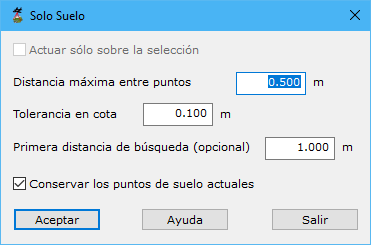

# Solo Suelo

[Ficha de herramientas Clasificar LiDAR](/mdtopx/fichas-de-herramientas/ficha-de-herramientas-clasificar-lidar.md)

Esta herramienta está destina a la búsqueda rápida de puntos pertenecientes al suelo. Sólo clasificaría puntos encontrados bajo esta condición con el tipo "2". 

El cuadro de diálogo únicamente solicita los siguientes parámetros:

* **Actuar sólo en la selección actual**: Se podrá activar esta opción para calcular sólo en los puntos que actualmente se tengan seleccionados.
* **Distancia máxima entre puntos**: Distancia máxima para considerar que los puntos están situados en la misma vertical. No conviene dar un valor muy alto. Se recomienda dar un valor cercano a la precisión planimétrica que pueda tener el LiDAR. Al contrario que en el resto de herramientas, este valor no se corresponde con la densidad de puntos tomados.
* **Tolerancia en cota**: para considerar puntos pertenecientes a la misma superficie.
* **Primera distancia de búsqueda**: Es un parámetro opcional. Indicaría cómo de denso sería el primer MDT para buscar suelo. No es aconsejable poner un valor muy pequeño si existen edificaciones con cubierta plana y de grandes dimensiones.
* **Conservar los puntos de suelo actuales**: Activar si se desean conservar los puntos previamente clasificados como suelo.

Vea también:

* [Buscar puntos elevados](/mdtopx/modulo-laser/buscar-puntos/buscar-puntos-elevados.md)
* [Buscar puntos aislados](/mdtopx/modulo-laser/buscar-puntos/buscar-puntos-aislados.md)
* [Buscar puntos aéreos](/mdtopx/modulo-laser/buscar-puntos/buscar-puntos-aereos.md)
* [Buscar puntos hundidos](/mdtopx/modulo-laser/buscar-puntos/buscar-puntos-hundidos.md)
* [Buscar puntos por diferencia de intensidad](/mdtopx/modulo-laser/buscar-puntos/buscar-puntos-por-diferencia-de-intensidad.md)
* [Buscar puntos según línea de vuelo](/mdtopx/modulo-laser/buscar-puntos/buscar-puntos-segun-linea-de-vuelo.md)
* [Buscar puntos según Geometría más RGB](buscar-puntos-segun-geometria-mas-rgb.md)
* [Buscar puntos según Geometría más intensidad](buscar-puntos-segun-geometria-mas-intensidad.md)
* [Buscar puntos en Superficies Planas](/mdtopx/modulo-laser/buscar-puntos/buscar-puntos-en-superficies-planas.md)
* [Buscar puntos en Paredes](/mdtopx/modulo-laser/buscar-puntos/buscar-puntos-en-paredes.md)
* [Superficie mágica](/mdtopx/modulo-laser/buscar-puntos/superficie-magica/)
* [Buscar puntos vecinos](buscar-vecinos.md)
* [Buscar puntos según infrarrojo](/mdtopx/modulo-laser/buscar-puntos/buscar-puntos-segun-infrarrojo.md)
* [Buscar huecos](/mdtopx/modulo-laser/buscar-puntos/buscar-huecos.md)
* [Buscar puntos según Área de superficie](buscar-puntos-segun-area.md)
* [Buscar puntos según planos de usuario](../formas-geometricas/buscar-puntos-sobre-planos.md) 
