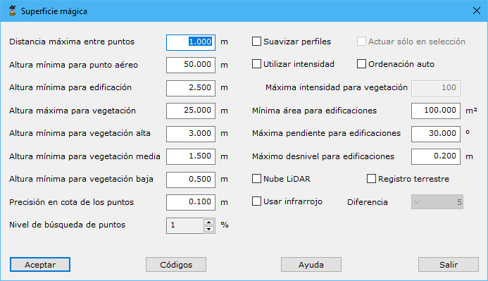

# Superficie mágica

[Ficha de herramientas Clasificar LiDAR](/mdtopx/fichas-de-herramientas/ficha-de-herramientas-clasificar-lidar.md)

Esta herramienta está destinada a la búsqueda y clasificación de puntos LiDAR de forma automática. El funcionamiento interno está basado en la combinación de diversos algoritmos y herramientas disponibles en el programa de forma inteligente, evitando al usuario la decisión de qué algoritmos y con qué parámetros se debe procesar en cada momento, en función del tipo de archivo y tipo de zona.

Los parámetros que precisa son los siguientes:

* **Distancia máxima entre puntos**: Distancia máxima para considerar que dos puntos sean considerados vecinos en la zona. Se recomienda que esta distancia sea 2 o 3 veces la distancia nominal en el momento del escaneado.
* **Altura mínima para punto aéreo**: Diferencia de altura mínima que debe tener un punto con su entorno para que sea clasificado como punto aéreo. Si se introduce un cero, no se tendrá en cuenta.
* **Altura mínima para edificación**: Diferencia de altura mínima que debe tener un punto con su entorno para que sea clasificado como punto edificación. Si se introduce un cero, no se tendrá en cuenta.
* **Altura máxima para vegetación**: Diferencia de altura máxima que debe tener un punto con su entorno para que sea clasificado como vegetación. Si se introduce un cero, no se tendrá en cuenta.
* **Altura mínima para vegetación alta**: Diferencia de altura mínima que debe tener un punto con su entorno para que sea clasificado como vegetación alta. Si se introduce un cero, no se tendrá en cuenta.
* **Altura mínima para vegetación media**: Diferencia de altura mínima que debe tener un punto con su entorno para que sea clasificado como vegetación media. Si se introduce un cero, no se tendrá en cuenta.
* **Altura mínima para vegetación baja**: Diferencia de altura mínima que debe tener un punto con su entorno para que sea clasificado como vegetación baja. Si se introduce un cero, no se tendrá en cuenta.
* **Precisión en cota de los puntos**: Precisión en la definición de la cota.
* **Nivel de búsqueda de puntos**: Valor entre 1 y 10 indicando el nivel de búsqueda de puntos del programa. Cuanto más bajo sea, más exhaustivo será el programa en la búsqueda, reiterando algunos de los procesos incluidos.
* **Suavizar perfiles**: Considerando que la toma de datos ha sido realizada siguiente líneas, se puede proceder a realizar un suavizado previo de los puntos para eliminar irregularidades. Sin embargo, esto también podría eliminar elementos característicos del relieve.
* **Actuar sólo en selección**: Si se han seleccionado puntos en pantalla antes de ejecutar la herramienta, se da la opción al usuario de que sólo calcule con los puntos seleccionados.
* **Utilizar intensidad**: Se podrá seleccionar esta opción si se desea utilizar el campo intensidad de cada punto para realizar la clasificación. La intensidad podría ser determinante en lugares donde existe alto contraste entre el suelo y los objetos sobre él, como puede ser en una plantación (olivar, viñedo, etc.). No es recomendable en el resto de situaciones.
* **Ordenación auto**: Se puede seleccionar esta opción para ordenar los puntos previamente. Esto es útil se los puntos proceden de varias uniones de grupos de puntos. Para ello, se utilizará el tiempo GPS de cada punto.
* **Máxima intensidad para vegetación**: Si se ha seleccionado la opción anterior, se podrá indicar cuál es el valor máximo para que un punto sea considerado como vegetación. Este valor oscilará entre 0 y 255.
* **Mínima área para edificaciones**: Para identificar edificaciones correctamente se puede indicar un valor mínimo de superficie. Por debajo de este valor, la zona no se considerará edificación.
* **Máxima pendiente para edificaciones**: Al igual que el valor anterior, este valor limitará las zonas consideradas como edificación, considerando que la superficie generada no podrá tener un valor de pendiente superior a este.
* **Máximo desnivel para edificaciones**: Por último, se puede indicar el valor máximo de desnivel que puede existir entre puntos pertenecientes a la misma zona que tiene posibilidad de ser edificación.
* **Nube LiDAR:** Activar si la nube procede de medidas láser o desactivar si la nube procede de una multicorrelación fotogramétrica.
* **Registro terrestre**: Se deberá seleccionar esta opción si el registro es terrestre, ya que la resolución y la precisión es muy superior al caso aéreo.
* **Usar infrarrojo**: Se deberá seleccionar esta opción si se desea utilizar el valor Infrarrojo en cada punto. Para ello, se deberá tener falso color en cada punto, es decir, la terna IR-R-B. Con ella, se podrá calcular el valor NDVI que permite identificar dónde hay vegetación y, por tanto, diferenciarla de la edificación.
* **Diferencia**: Si se ha seleccionado la opción anterior se deberá indicar el grado de sensibilidad de NDVI. Se indicará un valor cercano a 1, si el valor de infrarrojo no está muy definido en las zonas de vegetación; y cercano a 10, en caso contrario.
* ****[**Códigos**](codigos-lidar.md): Pulsando este botón se podrá acceder a un cuadro de diálogo donde cambiar el valor de clasificación de puntos secundarios.

El programa comenzará a procesar el archivo actual e irá mostrando los resultados parciales sobre el [panel de Resultados](../../../introduccion/paneles-de-la-aplicacion/panel-resultados.md)del programa. Si desea **Cancelar** el proceso el programa le preguntará si desea conservar los cálculos generados hasta ese momento. Además, si en la vista actual del documento se ha elegido visualizar los puntos mediante el parámetro clasificación LiDAR, la vista se irá actualizando para apreciar en tiempo real el progreso de la herramienta.

Vea también:

* [Buscar puntos elevados](/mdtopx/modulo-laser/buscar-puntos/buscar-puntos-elevados.md)
* [Buscar puntos aislados](/mdtopx/modulo-laser/buscar-puntos/buscar-puntos-aislados.md)
* [Buscar puntos aéreos](/mdtopx/modulo-laser/buscar-puntos/buscar-puntos-aereos.md)
* [Buscar puntos hundidos](/mdtopx/modulo-laser/buscar-puntos/buscar-puntos-hundidos.md)
* [Buscar puntos por diferencia de intensidad](/mdtopx/modulo-laser/buscar-puntos/buscar-puntos-por-diferencia-de-intensidad.md)
* [Buscar puntos según línea de vuelo](/mdtopx/modulo-laser/buscar-puntos/buscar-puntos-segun-linea-de-vuelo.md)
* [Buscar puntos según Geometría más RGB](../buscar-puntos-segun-geometria-mas-rgb.md)
* [Buscar puntos según Geometría más intensidad](../buscar-puntos-segun-geometria-mas-intensidad.md)
* [Buscar puntos en Superficies Planas](/mdtopx/modulo-laser/buscar-puntos/buscar-puntos-en-superficies-planas.md)
* [Buscar puntos en Paredes](/mdtopx/modulo-laser/buscar-puntos/buscar-puntos-en-paredes.md)
* [Buscar puntos Solo Suelo](../solo-suelo.md)
* [Buscar puntos vecinos](../buscar-vecinos.md)
* [Buscar puntos según infrarrojo](/mdtopx/modulo-laser/buscar-puntos/buscar-puntos-segun-infrarrojo.md)
* [Buscar huecos](/mdtopx/modulo-laser/buscar-puntos/buscar-huecos.md)
* [Buscar puntos según Área de superficie](../buscar-puntos-segun-area.md)
* [Buscar puntos según planos de usuario](../../formas-geometricas/buscar-puntos-sobre-planos.md)&#x20;
