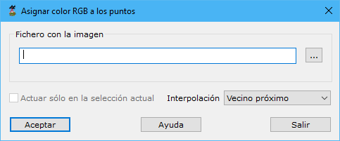

# Asignar color RGB a puntos

[Editar puntos LIDAR](../../fichas-de-herramientas/ficha-de-herramientas-archivos-lidar/editar-puntos-en-archivos-lidar.md)

Esta herramienta está destinada a añadir color RGB a cada punto a partir de una imagen georreferenciada externa. Esta imagen podrá ser una ortofotografía o una imagen con proyección cónica con su respectivo archivo de orientación externa. La herramienta es útil cuando no se ha registrado color originalmente con el láser, ya que permitirá añadir más información a la nube para mejorar la edición.

Los parámetros que precisa son los siguientes:

* **Fichero con la imagen**: Se indicar el archivo con la imagen ráster a partir del cual se extraerá el valor RGB a añadir a cada punto. Obviamente, la imagen deberá estar georreferenciada por medio de un archivo externa de tipo ORT, ORI o TFW. La imagen podrá provenir de una ortofotografía o de una imagen cónica tomada directamente desde un sensor cónico. Si no se tiene orientación de la imagen, se puede calcular con MDTopX. Para ello consulte la herramienta [Orientación Midiendo puntos](../../herramientas-para-imagenes/orientacion-midiendo-puntos.md). El formato de la imagen podrá ser BMP, TIFF o JPEG. Para localizar el archivo puede utilizar el botón situado a la derecha para abrir el explorador de Windows.
* **Actuar sólo en la selección actual**: Se podrá activar esta opción para calcular sólo en los puntos que actualmente se tengan seleccionados.
* **Interpolación**: Modo de interpolación para asignar color a los puntos según los píxeles cercanos. Las posibilidades son:
  * _Vecino próximo_: Asignar el valor del píxel más cercano.
  * _Bilineal_: Utilizando los cuatro puntos más cercanos.
  * _Bicúbica_: Utilizando los nueve puntos más cercanos.

Vea también:

* [Según color registrado](/mdtopx/modulo-laser/segun-color-registrado/)
* [Color de nube](/mdtopx/modulo-laser/vista/color-de-nube.md)
* [Buscar puntos según Geometría más RGB](../buscar-puntos/buscar-puntos-segun-geometria-mas-rgb.md)
