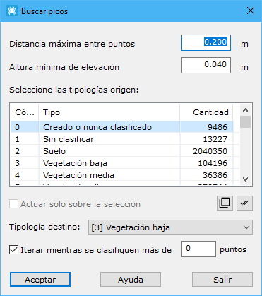

# Borrar picos

[Editar puntos LIDAR](../../fichas-de-herramientas/ficha-de-herramientas-archivos-lidar/editar-puntos-en-archivos-lidar.md)

Herramienta destinada a buscar y clasificar puntos cuya cota es superior a la de su entorno. Si se realizara un MDT incluyendo a estos puntos se producirían picos debido a su diferencia de cota.

Los parámetros que precisa son los siguientes:

* **Distancia máxima**: Distancia máxima para considerar dos puntos como adyacentes o vecinos en el terreno. Este parámetro dependerá de la densidad de puntos. Este campo servirá delimitar la zona abarcada por cada punto de toma.
* **Altura mínima de elevación**: Diferencia de cota mínima que deberá tener el punto con los de su alrededor.
* **Tipologías origen**: Tipos de puntos que se utilizarán en el cálculo.
* **Tipologías destino**: Tipo que se le asignará a los puntos encontrados.
* **Actuar sólo en la selección actual**: Se podrá activar esta opción para calcular sólo en los puntos que actualmente se tengan seleccionados.
* **Iterar mientras se clasifiquen más de x puntos**: La herramienta se repetirá mientras se hayan clasificado más puntos de los indicados en este campo.
