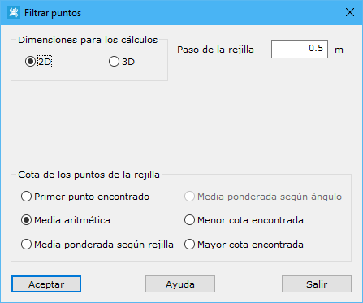

# Filtrar puntos

[Editar puntos LIDAR](../../fichas-de-herramientas/ficha-de-herramientas-archivos-lidar/editar-puntos-en-archivos-lidar.md)

Esta herramienta está destinada al filtrado de puntos láser, aligerando el fichero ya que se reducirá la densidad inicial.

Los parámetros que precisa son los siguientes:

* **Dimensiones para los cálculos**: Se deberá especificar si los puntos láser son 2D (LIDAR) o 3D (láser terrestre).
* **Paso de la rejilla**: Se deberá especificar la distancia que tendrán los puntos filtrados.
* **Cota de los puntos de la rejilla**: Se deberá elegir entre una de las siguientes opciones.
  * _Primer punto encontrado_: El programa utilizará la cota del primer punto encontrado en la zona cercana con la densidad fijada.
  * _Media aritmética_: El programa utilizará la cota media de todos los puntos encontrados en la zona cercana con la densidad fijada.
  * _Media ponderada según rejilla_: El programa utilizará la cota inversamente proporcional a la distancia de cada punto encontrado en la zona al centro de dicha zona.
  * _Media ponderada según ángulo_: El programa utilizará la cota inversamente proporcional al ángulo LIDAR registrado en cada punto encontrado en la zona.
  * _Menor cota encontrada_: El programa utilizará la menor cota encontrada entre los puntos que se hallen en la zona.
  * _Mayor cota encontrada_: El programa utilizará la mayor cota encontrada entre los puntos que se hallen en la zona.

Vea también:

* [Promediar pasadas](/mdtopx/modulo-laser/editar/promediar-pasadas.md)
