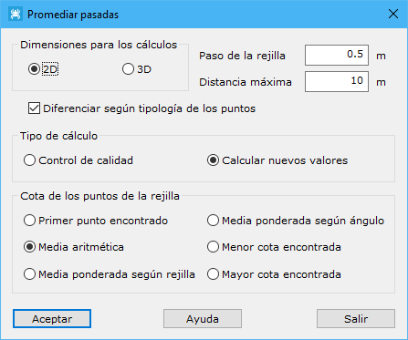

# Promediar pasadas

[Editar puntos LIDAR](../../fichas-de-herramientas/ficha-de-herramientas-archivos-lidar/editar-puntos-en-archivos-lidar.md)

Esta herramienta está destinada al promedio de puntos láser procedentes de diferentes puntos de toma y que coincidan espacialmente.

Los parámetros que precisa son los siguientes:

* **Dimensiones para los cálculos**: Se deberá especificar si los puntos láser son 2D (LIDAR) o 3D (láser terrestre).
* **Paso de la rejilla**: Se deberá especificar la distancia que tendrán los puntos promediados.
* **Distancia máxima**: Distancia máxima para considerar dos puntos como adyacentes o vecinos en el terreno. Este parámetro dependerá de la densidad de puntos. Este campo servirá delimitar la zona abarcada por cada punto de toma.
* **Diferenciar según tipología de los puntos**
* **Tipo de cálculo**:
  * _Control de calidad_
  * _Calcular nuevos valores_
* **Cota de los puntos de la rejilla**: Se deberá elegir entre una de las siguientes opciones.
  * _Primer punto encontrado_: El programa utilizará la cota del primer punto encontrado en la zona cercana con la densidad fijada.
  * _Media aritmética_: El programa utilizará la cota media de todos los puntos encontrados en la zona cercana con la densidad fijada.
  * _Media ponderada según rejilla_: El programa utilizará la cota inversamente proporcional a la distancia de cada punto encontrado en la zona al centro de dicha zona.
  * _Media ponderada según ángulo_: El programa utilizará la cota inversamente proporcional al ángulo LIDAR registrado en cada punto encontrado en la zona.
  * _Menor cota encontrada_: El programa utilizará la menor cota encontrada entre los puntos que se hallen en la zona.
  * _Mayor cota encontrada_: El programa utilizará la mayor cota encontrada entre los puntos que se hallen en la zona.

La herramienta sólo estará activa si existe más de un punto de registro o pasada.

Vea también:

* [Filtrar puntos](/mdtopx/modulo-laser/editar/filtrar-puntos.md)
