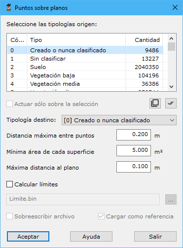

# Buscar puntos sobre planos

[Buscar formas geométricas](./)

Con esta herramienta se pueden clasificar puntos que forman superficies planas.

Los campos necesarios son los siguientes:

* **Tipología origen**: Se deberá seleccionar las tipologías que se considerarán en esta clasificación.
* **Actuar sólo en la selección actual**: Se podrá activar esta opción para calcular sólo en los puntos que actualmente se tengan seleccionados
* **Tipología destino**: Se deberá elegir la tipología de clasificación destino de los puntos que cumplan con las condiciones del cálculo.
* **Distancia máxima entre puntos**: Distancia máxima para considerar dos puntos como adyacentes o vecinos en el terreno. Este parámetro dependerá de la densidad de puntos. No es adecuado poner un valor demasiado elevado porque ello provocará que se consideren puntos muy alejados del punto en consideración. Si se indica un valor demasiado escaso, no se podrá relacionar el punto en consideración con ningún otro punto.
* **Área mínima de superficie**: Valor mínimo de área que tendrá que tener la superficie formada.
* **Máxima distancia al plano**: Valor máximo de distancia perpendicular al plano desde el punto para ser considerado perteneciente a la superficie en cuestión.
* **Calcular límites**: Además de clasificar los puntos, se podrá calcular la entidad vectorial que define la superficie formada.
* **Nombre**: Nombre del archivo generado con los límites vectoriales.
* **Sobrescribir archivo**: Si se desea sobrescribir un posible archivo existente.
* **Cargar como referencia**: Si se desean cargar los límites vectoriales después de terminado el cálculo.

Aceptando estos datos, el programa mostrará un [cuadro de diálogo](/mdtopx/modulo-laser/formas-geometricas/buscar-puntos-sobre-planos.md) donde se pueden gestionar los puntos que definen el plano.

Vea también:

* [Buscar puntos elevados](/mdtopx/modulo-laser/buscar-puntos/buscar-puntos-elevados.md)
* [Buscar puntos aislados](/mdtopx/modulo-laser/buscar-puntos/buscar-puntos-aislados.md)
* [Buscar puntos aéreos](/mdtopx/modulo-laser/buscar-puntos/buscar-puntos-aereos.md)
* [Buscar puntos hundidos](/mdtopx/modulo-laser/buscar-puntos/buscar-puntos-hundidos.md)
* [Buscar puntos por diferencia de intensidad](/mdtopx/modulo-laser/buscar-puntos/buscar-puntos-por-diferencia-de-intensidad.md)
* [Buscar puntos según línea de vuelo](/mdtopx/modulo-laser/buscar-puntos/buscar-puntos-segun-linea-de-vuelo.md)
* [Buscar puntos según Geometría más RGB](../buscar-puntos/buscar-puntos-segun-geometria-mas-rgb.md)
* [Buscar puntos según Geometría más intensidad](../buscar-puntos/buscar-puntos-segun-geometria-mas-intensidad.md)
* [Buscar puntos en Superficies Planas](/mdtopx/modulo-laser/buscar-puntos/buscar-puntos-en-superficies-planas.md)
* [Buscar puntos en Paredes](/mdtopx/modulo-laser/buscar-puntos/buscar-puntos-en-paredes.md)
* [Buscar puntos Solo Suelo](../buscar-puntos/solo-suelo.md)
* [Superficie mágica](/mdtopx/modulo-laser/buscar-puntos/superficie-magica/)
* [Buscar puntos vecinos](../buscar-puntos/buscar-vecinos.md)
* [Buscar puntos según infrarrojo](/mdtopx/modulo-laser/buscar-puntos/buscar-puntos-segun-infrarrojo.md)
* [Buscar huecos](/mdtopx/modulo-laser/buscar-puntos/buscar-huecos.md)
* [Buscar puntos según Área de superficie](../buscar-puntos/buscar-puntos-segun-area.md)

<video controls><source src="https://youtu.be/0NJjQvRX5CM" type="video/mp4"></video>
Identificación de puntos en planos

