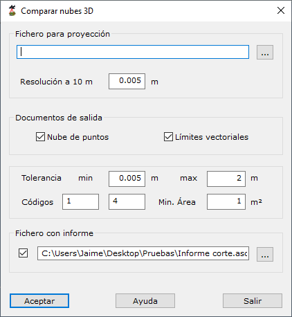

# Comparar nubes 3D

[Generar a partir de LIDAR](../../fichas-de-herramientas/ficha-de-herramientas-archivos-lidar/calcular-a-partir-de-lidar.md)

Mediante esta herramienta se pueden realizar comparaciones entre dos nubes de puntos.

Los parámetros necesarios son los siguientes:

* **Fichero para proyección**:
  * _Nombre_: Nombre del archivo modelo con el que se comparará el nuevo registro.
  * _Resolución_: Paso de distancia para hacer las comparaciones.
* **Documentos de salida**:
  * _Nube de puntos_: Si se desea la nube de puntos con los puntos donde se han encontrado diferencias.
  * _Límites vectoriales_: Si se desean los límites vectoriales generados con la agrupación de puntos donde han aparecido diferencias.
* **Parámetros de los documentos de salida**:
  * _Tolerancia_: Tolerancias mínimas y máxima entre las que se deben encontrar las diferencias que se desean considerar.
  * _Códigos_: Códigos en los que se almacenarán las zonas de diferencia negativa y positiva, respectivamente.
  * _Área mínima_: Valor mínimo que deberá tener una zona para ser considerada.
* **Informe**: Si se desea generar un informe en formato ASCII.
